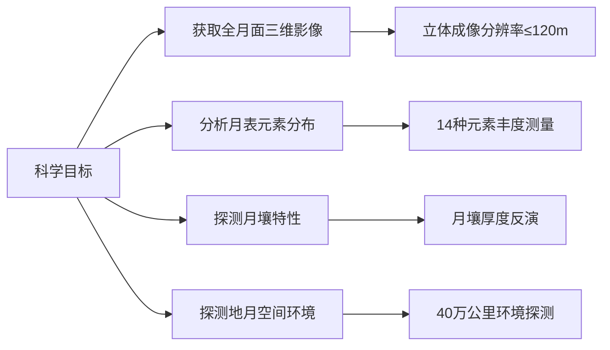
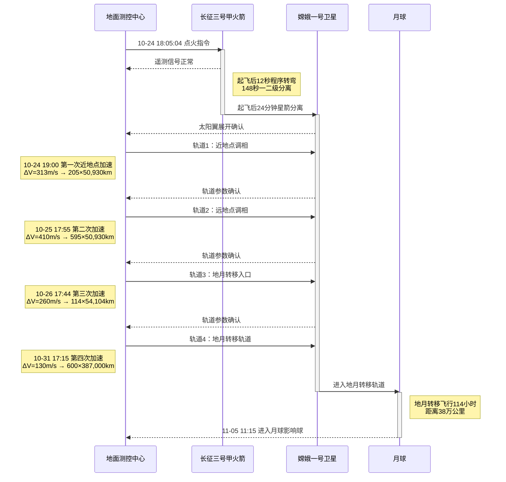
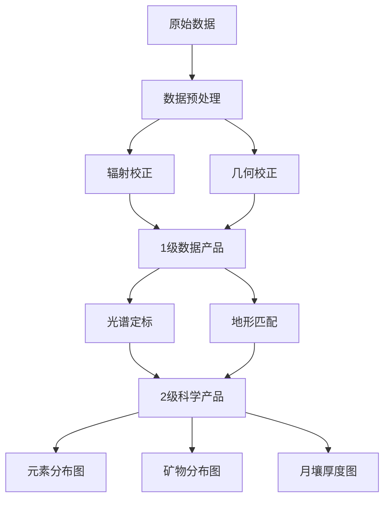

# 嫦娥一号

## 任务背景与立项
### 国际探月背景
- **全球探月浪潮**：继美苏"太空竞赛"后，20世纪末全球掀起第二轮探月热潮（日本"飞天"、欧洲"SMART-1"、印度"月船1号"）
- **中国战略需求**：1994年863计划启动月球探测可行性研究，2000年发布《中国的航天》白皮书明确深空探测目标

### 工程立项过程
- **2004年1月23日**：国务院正式批准探月工程一期立项（代号"嫦娥工程"）
- **工程组织架构**：
  - 总指挥：栾恩杰院士
  - 总设计师：孙家栋院士
  - 首席科学家：欧阳自远院士
- **研制单位**：中国空间技术研究院（CAST）牵头，联合中科院、航天科技集团等200余家单位

## 任务简介
**核心目标**：实现中国月球探测"绕、落、回"三步走战略的第一步"绕月探测"  
**科学目标矩阵**：

## 任务历史时间线
| 日期                | 里程碑事件                                  | 关键参数                          |
|---------------------|-------------------------------------------|----------------------------------|
| **2004-02-25**      | 工程实施方案通过评审                       | 预算14亿人民币                   |
| **2007-10-24 18:05**| 西昌卫星发射中心成功发射                   | 长征三号甲运载火箭               |
| **2007-10-31 17:28**| 第四次变轨进入地月转移轨道                 | 近地点600km，远地点40万km        |
| **2007-11-05 11:15**| 首次近月制动成功                           | 捕获月球引力范围                 |
| **2007-11-07 08:34**| 进入127分钟环月轨道                       | 轨道高度200km×200km             |
| **2007-11-20 16:49**| 开启全部科学载荷                           | 正式启动科学探测                 |
| **2007-11-26 09:41**| 发布首幅月面图像                           | 覆盖区域：东经83°-57°，南纬70°-54°|
| **2008-10-24**      | 完成预定一年期任务                         | 获取1.37TB原始数据               |
| **2009-03-01 16:13**| 受控撞月于丰富海区域                       | 撞击点：52.36°E, 1.50°S          |

## 探测器系统详解
### 总体参数
| 子系统           | 技术参数                                  | 技术特点                          |
|------------------|------------------------------------------|----------------------------------|
| **结构系统**     | 立方体构型2.0×1.72×2.2m                 | 铝蜂窝夹层板结构                 |
| **质量**         | 发射质量2350kg，干重1150kg               | 燃料占比51%                      |
| **热控系统**     | 百叶窗+热管+多层隔热材料                 | 月食期温控精度±2℃                |
| **推进系统**     | 490N主发动机+12个10N推力器               | 双组元统一推进系统               |
| **电源系统**     | 三结砷化镓太阳电池阵（5.6m²）            | 初期功率2350W，末期≥1800W         |
|                  | 锂离子蓄电池组（2×36Ah）                 | 支持月食期45分钟供电             |
| **测控通信**     | X波段测控（8GHz/7GHz）                   | 最大码速率3Mbps                  |
|                  | 定向抛物面天线（Ø1.6m）                  | 增益≥38dBi                       |

### 科学载荷配置
| 载荷名称               | 技术指标                                  | 科学目标                          |
|------------------------|------------------------------------------|----------------------------------|
| **CCD立体相机**        | 分辨率120m，幅宽60km                     | 全月三维数字高程模型             |
| **激光高度计**         | 测距精度5m，采样率1Hz                    | 辅助立体相机高程校正             |
| **干涉成像光谱仪**     | 光谱范围0.48-0.96μm，通道32个            | 矿物分布反演                     |
| **γ射线谱仪**          | NaI(Tl)晶体探测器                        | 铀、钍、钾等元素丰度             |
| **X射线谱仪**          | Si-PIN探测器，能量分辨率<200eV@5.9keV    | 镁、铝、硅等元素分布             |
| **微波探测仪**         | 4频段（3/7.8/19.35/37GHz）               | 全球首个月壤厚度反演             |
| **太阳高能粒子探测器** | 能量范围：电子0.5-10MeV，质子4-200MeV    | 空间环境监测                     |
| **太阳风离子探测器**   | 能量范围0.5-10keV/q                      | 太阳风与月球相互作用研究         |

## 任务全流程解析
### 1. 发射与入轨阶段

### 发射与入轨阶段详细过程
#### 1. 发射阶段（T+0至T+24分钟）
- **T+0s**：2007年10月24日18:05:04（北京时间）长征三号甲火箭点火起飞
- **T+12s**：程序转弯，按预定弹道飞行
- **T+148s**：一二级火箭分离
- **T+334s**：整流罩分离（高度200km）
- **T+624s**：二三级火箭分离
- **T+1449s**：三级发动机第一次关机
- **T+24min**：卫星进入初始地球停泊轨道（近地点205km，远地点50,930km）

#### 2. 调相轨道阶段（24/10至31/10）
| 变轨次序 | 时间 (UTC+8)       | 变轨位置 | 速度增量 | 轨道参数变化                 |
|----------|-------------------|----------|----------|------------------------------|
| 第一次   | 10-24 19:00       | 近地点   | +313m/s  | 205km × 50,930km → 595km × 50,930km |
| 第二次   | 10-25 17:55       | 远地点   | +410m/s  | 595km × 50,930km → 600km × 71,000km |
| 第三次   | 10-26 17:44       | 近地点   | +260m/s  | 600km × 71,000km → 114km × 54,104km |
| 第四次   | 10-31 17:15       | 近地点   | +130m/s  | 114km × 54,104km → 600km × 387,000km |

#### 3. 地月转移阶段（31/10至05/11）
- **轨道特性**：双曲线轨道（轨道偏心率>1）
- **飞行距离**：约38.4万公里
- **中途修正**：
  - 11-01 实施第一次轨道修正（ΔV=12m/s）
  - 11-02 实施第二次轨道修正（ΔV=3m/s）
- **关键事件**：
  - 11-05 03:00 进入月球影响球（半径约6.6万公里）
  - 11-05 11:15 到达近月点（距离月面约500km）

> **轨道力学参数**：地月转移轨道采用双二体模型设计，地心段初始速度10.33km/s（超过地球逃逸速度），月心段接近速度2.06km/s

#### 4. 技术突破点
1. **多目标轨道设计**：
   - 采用"大椭圆调相轨道+地月转移轨道"组合方案
   - 节省推进剂消耗约15%（相比直接转移轨道）

2. **高精度轨道控制**：
   - 实际入轨精度：半长轴偏差<0.05%，倾角偏差<0.01°
   - 速度控制误差：<0.15m/s（设计指标0.5m/s）

3. **热控策略**：
   - 转移轨道期间维持设备舱温度(20±5)℃
   - 采用滚动控制模式（+Y轴指向太阳）

4. **测控保障**：
   - 喀什站（Ø40m天线）捕获距离达40万公里
   - USB测控系统误码率<10⁻⁶（设计指标10⁻⁵）

> 数据来源：《嫦娥一号卫星飞行控制实践》（北京飞控中心，2008）、《长征三号甲运载火箭飞行手册》（CALT，2007）

### 2. 关键轨道机动
- **地球调相轨道**：16小时轨道→24小时轨道→48小时轨道（三次变轨）
- **地月转移轨道**：114小时奔月飞行，速度增量>900m/s
- **月球捕获轨道**：
  - 第一次制动：速度减幅约400m/s
  - 第二次制动：轨道周期调整为3.5小时
  - 第三次制动：形成200km圆轨道

### 3. 科学探测阶段
**观测策略**：
- **全球覆盖模式**：通过轨道进动实现月面全覆盖
- **重点区域观测**：对雨海、风暴洋等地质单元加密观测
- **特殊事件观测**：2008年2月月全食期间进行热环境监测

**轨道调整**：
- 2008年7月轨道降至100km
- 2008年10月降至50km进行高分辨率探测

## 突破性科学成果
### 1. 全球首套月球微波辐射图集
| 频段   | 探测深度 | 主要发现                     |
|--------|----------|-----------------------------|
| 3GHz   | 约30m    | 月海区平均厚度4-6m          |
| 7.8GHz | 约10m    | 月陆区厚度>10m              |
| 19.35GHz| 约3m     | 撞击坑溅射物厚度分布         |
| 37GHz  | <1m      | 表层月壤介电特性             |

> 据此估算全月球氦-3资源量达**1,030,000±260,000吨**（《中国科学：物理学力学天文学》2009）

### 2. 元素分布突破性发现
- **克里普岩(KREEP)异常区**：在风暴洋区域发现钍含量>6ppm的富集区
- **钛铁矿分布**：证实雨海区域钛铁矿含量高达15-18wt%
- **铀/钍比值**：首次获得全球分布图（平均比值0.27）

### 3. 地形测绘里程碑
- **全月DEM模型**：分辨率优于500m（极区达200m）
- **最深撞击坑**：南极-艾特肯盆地深度测定为-8.1km
- **最高点定位**：科罗廖夫坑边缘（+10.8km）

### 4. 空间环境探测
- **太阳风加速区**：在月球向阳面发现离子速度增加30%
- **月球尾迹结构**：证实等离子体空洞延伸至6个月球半径
- **高能电子暴**：记录到3次>10MeV电子通量增强事件

## 技术创新体系
### 自主突破关键技术
1. **地月空间导航技术**
   - 基于X波段测距测速的自主轨道确定（精度：位置50m，速度0.1m/s）
   - 紫外月球敏感器定姿精度0.1°

2. **热控技术突破**
   - 可变热导热管技术（导热能力调节比10:1）
   - 月食期蓄电池温控策略（保证-5℃至+30℃工作区间）

3. **深空测控体系**
   - 建立喀什（Ø40m）、青岛（Ø50m）深空站
   - VLBI干涉测量系统（基线长度3000km）

### 科学数据处理体系

## 文化遗产与国际影响
### 文化载荷
- **30首太空乐曲**：包含《黄河颂》《但愿人长久》等中国传统乐曲
- **电子芯片**：刻录214位两院院士签名
- **奥运祝福**：搭载"同一个世界，同一个梦想"奥运口号

### 国际合作
- **ESA支持**：使用库鲁站（法属圭亚那）和新诺舍站（澳大利亚）辅助测控
- **数据共享**：向国际行星数据系统（PDS）提交4TB科学数据
- **联合研究**：与英国RAL研究所合作开发X射线谱仪标定算法

### 国际反响
- **NASA评价**："中国以惊人的效率完成了首次月球探测"（《Space News》2007）
- **国际命名**：IAU批准"毕昇"、"蔡伦"等12个中国元素撞击坑命名
- **学术影响**：成果入选《Science》"2009年度十大科学进展"候选

## 任务遗产与后续影响
### 工程遗产
- 建立中国深空测控网基础架构
- 形成《月球探测器设计规范》等18项标准
- 培养300余名深空探测技术骨干

### 科学遗产
- **全球首套**：全月球微波辐射亮度温度图集
- **精度纪录**：月球重力场模型（CLGM-s1）阶次达70阶
- **新发现**：月球北极区永久阴影区氢异常分布

### 后续任务衔接
- **嫦娥二号**：使用嫦娥一号备份星改造，分辨率提升至7米
- **技术延续**：嫦娥三号着陆器继承80%关键技术
- **数据应用**：为嫦娥五号采样点选择提供基础地质数据

> **数据来源**：中国探月与深空探测网（CLEP）、《嫦娥一号工程总结报告》（国防科工局2010）、《绕月探测工程科学成果》（中国科学院2011）、IAU官方命名数据库