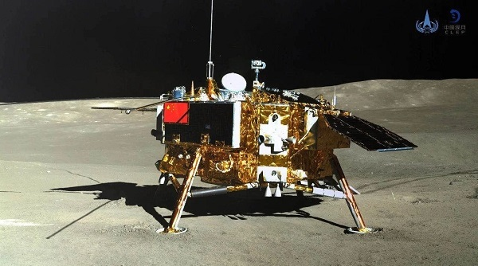
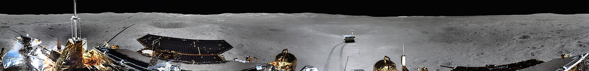

# 嫦娥四号

## 任务简介

嫦娥四号是中国探月工程嫦娥工程第二阶段的月球探测器——嫦娥三号的备份星。

嫦娥四号着陆器、“玉兔二号”月球车北京时间2018年12月8日02时23分34.3666秒由长征三号乙改进Ⅲ型运载火箭（遥30）发射升空。月球车上搭载中国、荷兰、德国、瑞典、沙特阿拉伯等其他国家航空组织的科学仪器。12月12日16时45分，进入月球轨道。2019年1月3日10时26分，嫦娥四号探测器着陆在月球背面东经177.6度、南纬45.5度附近的预选着陆区，完成世界首次在月球背面软着陆，并通过”鹊桥“中继星传回世界第一张近距离拍摄的月背影像图。这是人类首次实现月球背面软着陆和巡视勘察，同时也是人类首次在月球的高纬度极地着陆，也是人类首次月背与地球的中继通信。

**工程目标**

1. 研制发射月球中继通信卫星，实现国际首次地月拉格朗日L2点的测控及中继通信。
2. 研制发射月球着陆器和巡视器，实现国际首次月球背面软着陆和巡视探测。

**科学任务**

- 开展月球背面低频射电天文观测与研究。
- 开展月球背面巡视区形貌、矿物组份及月表浅层结构探测与研究。
- 试验性开展月球背面中子辐射剂量、中性原子等月球环境探测研究。

## 任务历史

嫦娥四号最初是作为嫦娥三号的备份。嫦娥三号发射成功后，曾计划不再发射嫦娥四号。

2015年12月2日，国防科工局组织召开了探月工程重大专项领导小组第十四次会议，审议通过嫦娥四号任务实施方案调整报告，确定了继续开展嫦娥四号发射任务。2017年12月，探月与航天工程中心正式宣布嫦娥四号任务计划，于2018年执行两次发射：上半年发射鹊桥号中继星，下半年发射嫦娥四号探测器。

## 探测器基本参数

玉兔二号月球车长1.5米，宽约1米，高约1.1米，有两个可折叠太阳能电池板和六个轮子。顶部有用于地月对话的通讯天线，车身有四台相机共同工作。肩部有两片可以打开的太阳能电池帆板，腿部有六个轮状的移动装置。

月球车采用月昼时工作，月夜时休眠的作息模式。

#### 相机系统

嫦娥四号相机，由其地形地貌相机研制团队，即中国科学院西安光学精密机械研究所研发，实际安装了两台相机，高度1.5米，基线长270毫米，以进行立体成像。

香港理工大学团队开发了嫦娥四号用“相机指向系统”，其重2.8千克，长宽深 85x27x16 cm，安装于嫦娥四号登陆器顶端。该系统起云台作用，可以自主旋转，自由度为垂直移动120度，左右转旋350度。

相机系统总成可以保证在-44～55 °C温度范围内工作，其完成了月球背面全景照片拍摄，但由于自由度限制，所以没有天顶与地心（设备自身）的样貌。

#### 科学仪器

搭载了以下的科学载荷，包括:

- 由中华人民共和国研制的全景相机、红外成像光谱仪和测月雷达，用于获取巡视区的月表图像、探测巡视路线上的月壤厚度和月壳浅层结构；
- 一台与瑞典合作研发的中性原子分析仪，用于观测巡视探测点10-10000伏特能量范围内的能量中性原子及正离子；
- 一台由沙特阿拉伯杜勒国王科技城研制的小型光学成像探测仪；
- 一台德国基尔大学研发的月表中子与辐射剂量探测仪。
- 除此之外还搭载了3项由哈尔滨工业大学、中山大学、重庆大学等中国国内高等院校所研制的科学技术试验项目。
- 月球微型生态系统。着陆器带有一个由重庆大学牵头研制的总重2.608 kg的微生物科普试验载荷罐，里面装有种子和昆虫卵，以测试植物和昆虫是否可以于地球外共同生长。该实验载荷罐中除了马铃薯、油菜、棉花、拟南芥、果蝇、酵母6种生物，还有18毫升水、空气、土壤、热控与两个相机，可以在零下60度到零下80度内稳定保持适宜生物生存的温度。

#### 着陆器有效载荷

|载荷名称|主要技术指标|
|--|--|
|地形地貌相机|波段范围/nm 420-700 正常成像距离/m 5~∞ 有效像元数量 ≥2352x1728  颜色 彩色(R, G, B) 视场角(°) 22.9X16.9(偏差不超过5%) 系统静态传函 ≥0.20(全视场，静态成像时测) 信噪比/dB   　≥40(最大信噪比)   　≥30(反照率 0.09,太阳高度角30°)|
|降落相机|波段范围/nm 419-777 正常成像距离/m 4~∞ 有效像元数量 ≥1024x1024 视场角(°) 45X45(偏差不超过5%) 系统静态传函 ≥0.20(全视场) 信噪比/dB   　≥40(最大信噪比)   　≥30(反照率0.09,太阳高度角30°)|
|低频射电频谱仪|工作频段 / MHz 0.1~40 接收机灵敏度/ (nV·Hz-1/2) ≤10 动态范围/dB ≥75 频率分辨率   　1~10 kHz(0.1~1.0 MHz)   　100~200 kHz(1.0~ 40 MHz)|
|中子与辐射剂量探测仪  　　　（LND）|快中子能谱 2~20MeV,32个能道 热中子通量10~104 min-1 质子能谱 7~30MeV,32个能道 电子能谱 60~500keV,32个能道 α粒子能谱 7~20MeV/n,32个能道 重离子能谱 10~30MeV/n,32x32个矩阵 LET 谱范围 0.1~430keV/μm,6 4 个能道 时间分辨率   　剂量率1 min，质子5 min   　电子5 min，重离子30 min 注：表中n表示每个核子，例如对于Fe，n为56|

#### 巡视器有效载荷

|载荷名称|主要技术指标|
|--|--|
|全景相机|波段范围/nm 420-700 成像模式 彩色成像，全色成像（可切换） 正常成像距离/m 3~∞ 视场角(°) 19.7X14.5(偏差不超过5%) 系统静态传函 ≥ 0.20(全视场，静态成像时测) 信噪比/dB   　≥40(最大信噪比)   　≥30(反照率0.09,太阳高度角30°)|
|测月雷达|脉冲电压幅度/V 	 第一通道 1000（偏差不超过5%） 	 第二通道 ≥400（偏差不超过5%） 脉冲重复频率/kHz   　第一通道 0.5,1,2（可切换）   　第二通道 5,10,20（可切换） 脉冲上升时间/ns   　第一通道 ≤5  　 第二通道 ≤1 工作频带/MHz   　第一通道 10~175  　 第二通道 10~1000 输入动态范围/dB   　均优于90 中心频率/MHz   　第一通道 60   　第二通道 500 工作带宽/MHz   　第一通道 ≥40  　 第二通道 ≥450 驻波系数   　第一通道 ≤3  　 第二通道 ≤2.5 探测深度/m   　第一通道 ≥100  　 第二通道 ≥30 厚度分辨率   　第一通道 米级  　 第二通道 30 cm|
|红外成像光谱仪|光谱范围(nm) 　450~950(可见近红外) 900~2400(短波红外)  光谱分辨率(nm)  　2~10(可见近红外) 3~12(短波红外) 视场(°)  　6×6(可见近红外) 2×2(短波红外) 系统静态传函 MTF>0.1（可见近红外） 信噪比/dB   　≥40(最大信噪比)   　≥30(可见近红外，反照率0.09,太阳高度角45°)   　≥30(短波红外，反照率0.09,太阳高度角15°)|
|中性原子探测仪  （ASAN）|观测要素 能量中性原子 (ENA), 正离子 能量范围 10 eV~10 keV 质量分辨率   　能量中性原子: 氢原子,其他成分原子组   　正离子: 质荷比 1,2,4,8,16,32 能量分辨率 7%(正离子), 30%(能量中性原子) 时间分辨率 10 s|

## 任务流程

### 前期准备

为了保证月球背部与地球的通信，在嫦娥四号发射前发射了鹊桥号中继卫星。

#### 鹊桥号中继星

鹊桥号中继卫星是一颗服务嫦娥四号的地月间通讯中继卫星。

鹊桥号是全球首次发射月球专用通信中继卫星，于2018年5月21日发射往地月拉格朗日L2点。由于月球比地球小，地球和中继卫星之间的信号传播几乎无法遮挡。嫦娥一号卫星系统总指挥兼总设计师叶培建说，希望这颗中继星寿命很长。这样，未来几年如果有别的国家探索月球背面，也可以得到中国中继星的通信服务。

2014年，中国探月工程三期再入返回飞行试验器服务舱曾进入环绕地月L2点的李萨如轨道开展试验，实现了环绕地月L2点飞行三圈，验证了轨道设计、轨道控制和轨道维持技术。

另外，发射鹊桥号卫星的运载火箭还搭载了龙江一号与龙江二号微卫星。龙江一号在地月转移轨道失去控制，龙江二号则完成了不少任务。

### 发射

2018年12月8日02时23分34.3666秒，嫦娥四号在西昌卫星发射中心用长征三号乙运载火箭成功发射。此次发射任务是长征系列运载火箭的第294次发射。

2018年12月12日16时39分25秒，嫦娥四号进行了近月制动，在变推力发动机点火356秒后，顺利进入近月点100公里、远月点400公里的环月轨道。

2018年12月30日08时55分，嫦娥四号探测器在环月轨道成功实施变轨控制，顺利进入预定的月球背面着陆准备轨道。

### 着陆

#### 着陆区

着陆器的着陆时间为2019年1月3日10时26分，成功在预选的着陆区月球背面南极-艾特肯盆地（South Pole-Aitken，SPA）内的冯·卡门撞击坑（Von Kármán）着陆，坐标是南纬45.5度，东经177.6度。着陆点之后被命名为天河基地。

#### 玉兔二号月球车

着陆器携带着的巡视器名称于2019年1月3日公布，称“玉兔二号”巡视器。1月3日15时07分，北京航天飞行控制中心通过鹊桥号中继卫星向嫦娥四号发出着陆器与巡视器分离指令，巡视器开始分离，于22时22分踏上月面。

截至2020年1月，“玉兔二号”月球车累计行驶357.695米。嫦娥四号着陆器和“玉兔二号”月球车分别于1月2日14时11分和20时30分完成第十三月昼工作，按地面指令完成月夜模式设置，顺利进入月夜休眠。

 

- 嫦娥四号登陆月球背面拍摄的全景图

## 任务成果

2019年5月15日，学术期刊《自然》在线发表了中国科学院国家天文台、中科院上海技术物理研究所空间主动光电技术重点实验室、中科院地球化学研究所的研究成果，科学家们利用嫦娥四号搭载的可视-近红外成像光谱仪（VINS）的光谱初始观测结果推断出，月球表面存在的低钙辉石和橄榄石矿物可能起源于月球地幔。这也是人类首份月球背面幔源物质初步证据。

2019年11月25日，英国皇家航空学会2019年度颁奖典礼在英国伦敦举行，嫦娥四号任务团队获得本年度全球唯一的团队金奖，该奖也是英国皇家航空学会成立153年来首次向中国项目颁发的奖项。嫦娥四号着陆器和“玉兔二号”巡视器已分别结束月夜休眠期，受光照成功自主唤醒，恢复月面工作，进入第十二个月昼工作期。截至目前，嫦娥四号在月球背面的工作时长已超过300天，远远超出设计寿命；“玉兔二号”巡视器克服月背复杂地形等障碍，行驶里程也已超过300米，实现了“双三百”的突破。
