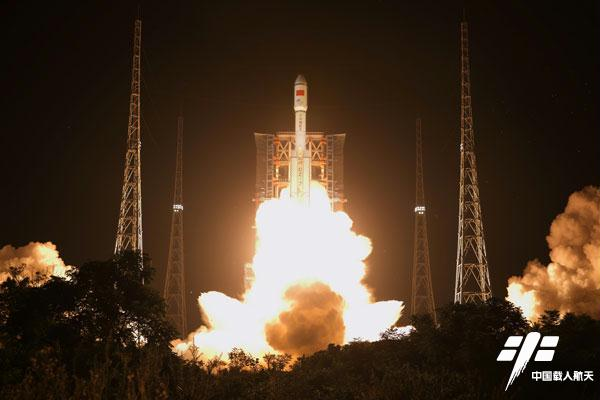
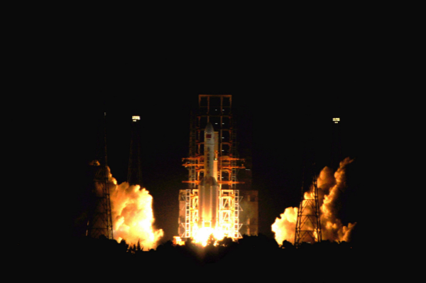
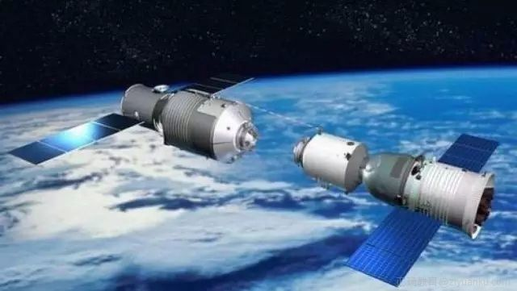
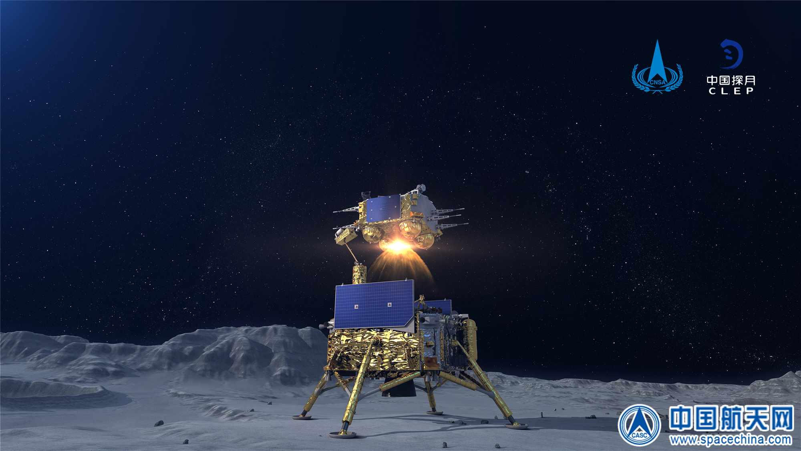
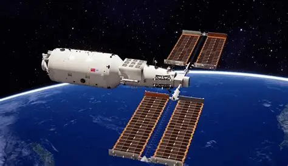
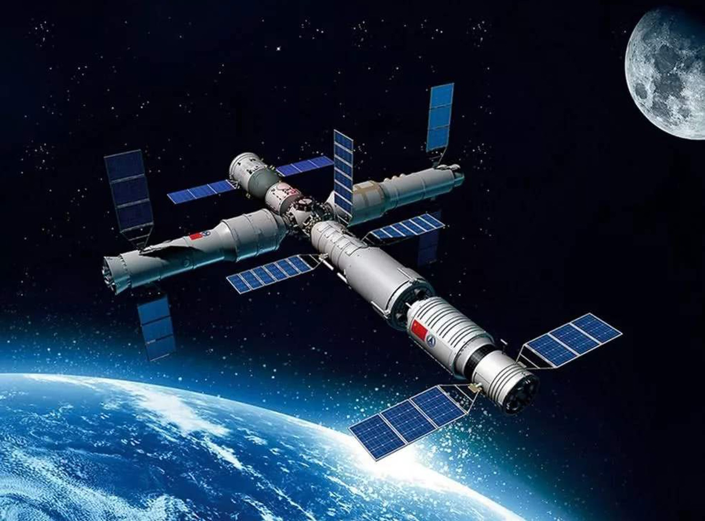

<!--
 * @Author: blueWALL-E
 * @Date: 2025-06-24 16:42:24
 * @LastEditTime: 2025-06-24 16:46:23
 * @FilePath: \Chinese Aerospace History\载人航天工程\十四大分系统介绍\文昌发射场系统.md
 * @Description: 文昌发射场系统
 * @Wearing:  Read only, do not modify place!!! 
 * @Shortcut keys:  ctrl+alt+/ ctrl+alt+z
-->
# 文昌发射场系统

## 简介

主要承担“天宫”空间站舱段和“天舟”货运飞船的发射任务。主要任务是负责运载火箭、飞船、空间站、有效载荷和航天员系统装船设备在发射场的测试和发射，并提供相应保障条件。海南文昌航天发射场于2007年8月启动建设，是生态、环保、开放的航天发射场。

## 发展历程

20世纪70年代，海南岛因纬度优势被列为发射场首选，但因为冷战安全考虑将发射场选在了西昌。

20世纪90年代中期，海南文昌发射场建设项目开始酝酿，经过了多轮科学评估。据中国科学院院士、著名火箭专家余梦伦介绍，最初论证时，曾有海南三亚方案、文昌方案、广东阳江方案等3个方案，但经过专家的综合评估，文昌最终被选定为我国的第四个卫星发射场。

2007年8月获国务院、中央军委批准立项。2009年9月14日，文昌发射场正式开工建设。2014年11月基本建成。

2016年6月25日，长征七号运载火箭顺利升空，文昌发射场首次发射成功。

2016年11月3日，长征五号运载火箭在文昌发射场首飞成功，标志着我国运载火箭实现升级换代，运载能力进入国际先进行列，是由航天大国迈向航天强国的关键一步。

2017年4月20日，我国首艘货运飞船天舟一号于文昌发射场发射升空，与天宫二号空间实验室先后进行3次交会对接和推进器在轨补给。

2020年5月5日，长征五号B搭载新一代载人飞船试验船和柔性充气式货物返回舱试验舱从文昌发射场首飞成功，验证了火箭总体方案、各分系统方案的正确性、协调性，突破了大尺寸整流罩分离技术、大直径舱箭连接分离技术、大推力直接入轨偏差精确控制技术等一批新技术，为我国空间站在轨建造任务奠定了重要基础。

2020年7月23日，我国在中国文昌航天发射场，用长征五号遥四运载火箭将我国首次火星探测任务“天问一号”探测器发射升空，成功将探测器送入预定轨道，开启火星探测之旅，迈出了我国自主开展行星探测的第一步。

2020年11月24日，我国在中国文昌航天发射场，用长征五号遥五运载火箭成功发射探月工程嫦娥五号探测器，顺利将探测器送入预定轨道，开启我国首次地外天体采样返回之旅。

2020年12月22日，长征八号运载火箭在文昌航天发射场点火起飞，成功将5颗试验性卫星送入预定轨道。长征八号运载火箭首飞成功，将有力推动中国中型运载火箭的更新换代，满足未来中低轨高密度发射任务需求。

2021年4月29日，搭载空间站天和核心舱的长征五号B遥二运载火箭，在我国文昌航天发射场点火升空，约494秒后，天和核心舱与火箭成功分离，进入预定轨道，12时36分，太阳能帆板两翼顺利展开且工作正常，发射任务取得圆满成功。此次发射任务成功，标志着中国空间站在轨组装建造全面展开，为后续关键技术验证和空间站组装建造顺利实施奠定了坚实基础。

2021年5月29日，我国在海南文昌航天发射场准时点火发射天舟二号货运飞船。这是空间站货物运输系统的第一次应用性飞行。

2021年9月20日，长征七号遥四运载火箭在海南文昌发射场腾空而起，成功将天舟三号货运飞船送入预定轨道，我国空间站在轨建造阶段第四次发射任务取得圆满成功。

2022年7月24日，我国在海南文昌航天发射场，运用我国目前近地轨道运载能力最强的运载火箭——长征五号B，成功将我国空间站建造阶段首个实验舱，同时也是我国迄今为止重量最大的载荷——问天实验舱送至预定轨道。中国空间站建造关键之战取得了圆满成功！

2022年10月31日，长征五号B遥四运载火箭托举梦天实验舱升空，将空间站梦天实验舱成功送入预定轨道，发射任务取得圆满成功，三舱基本构型的中国空间站迎来最后一个舱段。接下来，梦天实验舱将与空间站天和核心舱完成对接并进行转位操作。届时，天和核心舱、问天实验舱、梦天实验舱在同一平面形成中国空间站“T”字基本构型，从而向着建成空间站的目标迈出关键一步，国家太空实验室建设即将全面“竣工”。

## 发射场地位位置与环境

### 地理位置

文昌发射场位于海南省文昌市龙楼镇，北纬19.61345°，是我国首个滨海发射场，也是世界上少有的低纬度发射场。

相比目前已有的内陆发射场，海南文昌发射场有四个优点：

1. 航区及落区安全  
新一代运载火箭一级落点的射程在1000km左右，经过考察，海南文昌发射场在这个范围内为无人居住的海域。另外，虽然航区通过部分国家的领土，但火箭飞越这些国家领土时已经飞出大气层，这不会带来争议。因此，新一代运载火箭在海南文昌发射场执行任务时，航区和落区有较好的安全性。

2. 运载效率高  
火箭发射场距离赤道越近、纬度越低，发射卫星时就可以最大限度地利用惯性产生的离心力，使得所需要的能耗较低，也就是说，使用同样燃料可以达到的速度更快。海南岛是中国陆地纬度最低、距离赤道最近的地区。在这里发射地球同步卫星，和西昌相比，卫星定点质量可以增加5.1~7.4%，同等质量的推进剂可使卫星在轨寿命增加2.7~3.9年；和酒泉相比，卫星定点质量可以增加16.3~18.5%，同等质量的推进剂可使卫星在轨寿命增加8.7~9.8年，这给卫星用户带来巨大的经济效益，可以显著提高我国火箭发射商业卫星的竞争力。

3. 射向范围大  
由于在沿海地区发射卫星时不存在落区和航区的安全问题，射向范围可以放宽到80度到190度左右，可以发射各类卫星和航天器。

4. 大尺寸结构件可海运  
在沿海地区建立发射场，使新一代运载火箭及大结构尺寸航天器通过海路运输成为可能。

### 环境

文昌航天发射场濒临海边，气候复杂多变，“高温、高湿、高盐雾、强降雨、强台风、强雷暴”直接影响发射场设施设备的可靠性、安全性和使用寿命，增加维护保障费用，并使任务保障存在安全隐患，这是现有三个内陆发射场在设计建设中从未面临的挑战。  
针对防台风问题，设计人员通过前期模拟分析系统掌握了火箭垂直总装测试厂房、固定勤务塔等高大复杂建构筑物的抗风薄弱环节，确定了结构体系方案，使其达到百年一遇强台风下的安全要求。同时通过“三垂一远”测试发射控制模式，优化了火箭测试发射流程，缩短了火箭的室外暴露时间，减小了不利天气的影响。此外还建立完善的气象预报系统，及时发布台风等灾害天气预警，合理调整任务计划，在火箭航天器转运、待命发射等关键时段，进行有效规避。发射场的高大复杂建构筑物成功经受了2014年7月“威马逊”超强台风和9月“海鸥”强台风的连续检验，没有形成主体结构损伤。  
设计人员针对防雷电问题为发射场不同地面设施制定了不同类别、不同等级的防雷电技术方案，各单体建筑均能满足防雷电要求。同时将当前比较先进、安全可靠的四塔架空避雷线立体网式防雷电系统应用于发射工位，能有效降低防雷装置高度，缩小间距，又能增强防雷保护效果。此外还在发射场建设雷电监测预警系统、闪电探测定位系统、空中电场探测系统，构建被动防护与主动预警相结合的雷电综合防护体系，雷电拦截效率达到98.5％，有效防范了雷电对火箭、航天器和大型设施设备的影响破坏。  
通过各类前期试验验证，设计人员在解决发射场地面设施设备防盐雾腐蚀问题上，确定了防护寿命标准可达10～15年的重度防腐涂装保护体系，采用工艺简便、可操作性强、经济适用且能适应沿海高温、高湿、盐雾环境的新材料、新工艺和新技术。同时加强发射场空调系统建设，利用空调系统进行除湿和盐雾吸附，创造低湿、低盐雾的室内工作环境。此外还建立盐雾监测系统，制定维护保养规范与制度，有效地提高了发射场系统的可靠性，延长了设施设备的寿命。

## 发射场基本设施

从2002年3月起，经过综合论证、立项论证、可行性研究、工程设计等阶段，文昌航天发射场于2009年9月开工建设，2014年10月竣工交付使用。发射场主要分为技术与发射区、办公生活区、技术研发与航天员训练准备区及测控站等四个功能分区。
技术区主要完成火箭、航天器总装测试，建有长征五号和长征七号运载火箭垂直总装测试厂房各1座、水平转载准备厂房、航天器总装测试厂房、航天器加注与整流罩装配厂房、指挥控制中心。发射区完成火箭加注和发射准备，主要建设长征五号和长征七号火箭固定勤务塔、导流槽各1座，以及相关配套设施区。办公生活区位于文昌市新市区，距发射场区36千米，主要设有发测站、指控站、通信站以及配套公用设施等项目。技术研发与航天员训练准备区位于海口市东部，距离发射场90千米，社会依托条件好。测控站分为铜鼓岭和西沙两站，满足火箭、航天器分离前的测控、通信需求。铜鼓岭测控站紧邻发射场区，西沙测控站建于琛航岛。此外，气象卫通站位于文昌市南阳镇山城村，主要建有卫通机房、气象雷达机房及配套保障设施。

## 备注

认真填写内容，做到完整准确详实，不遗漏重要内容，所有内容不得直接百度（可以根据百度结果作为线索），AI，要根据真是新闻发布会官方网站文献资料等官方数据来。
格式按照模板来。可以加上你觉得其他重要内容，在保证内容准确的基础上，尽可能多收集资料。
