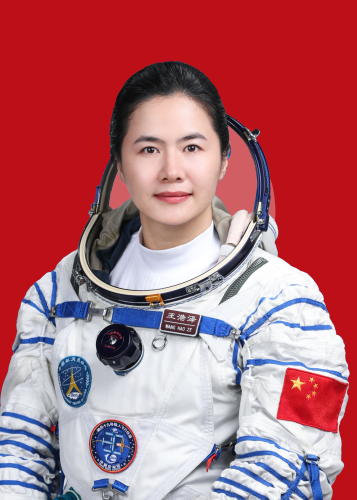
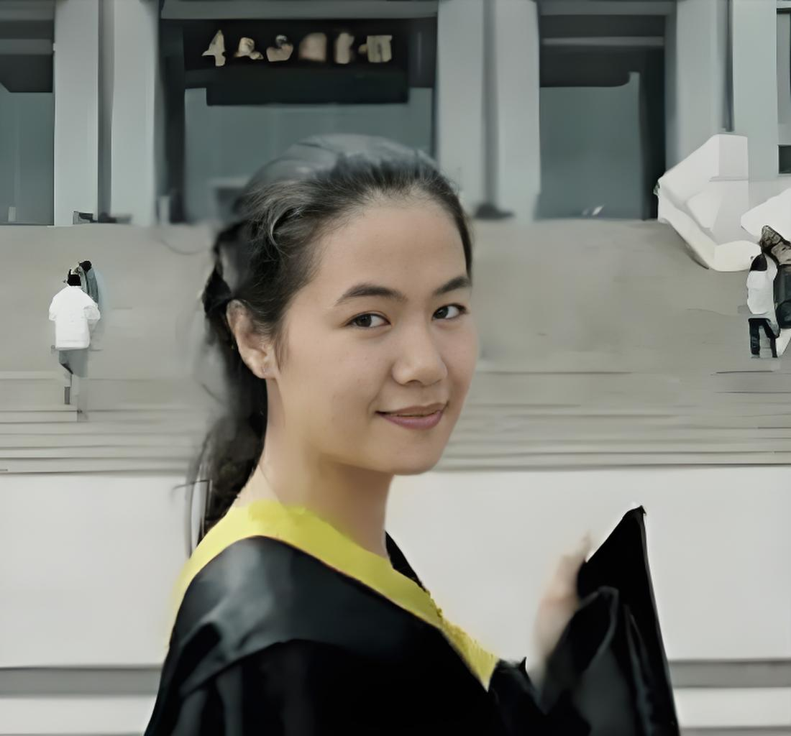
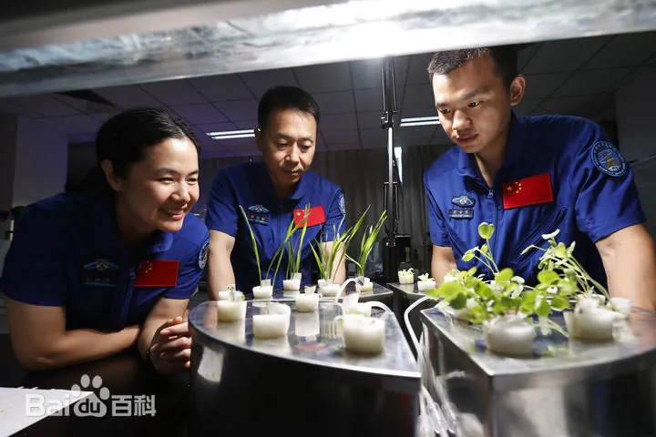
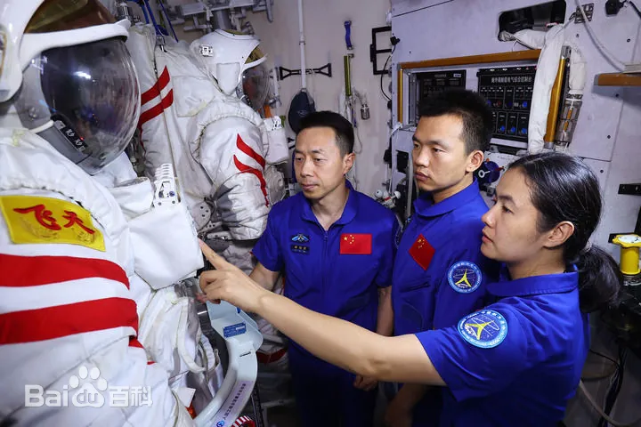
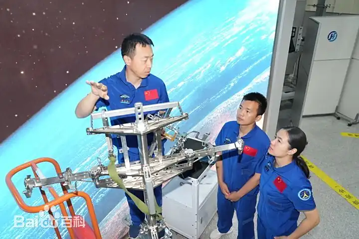
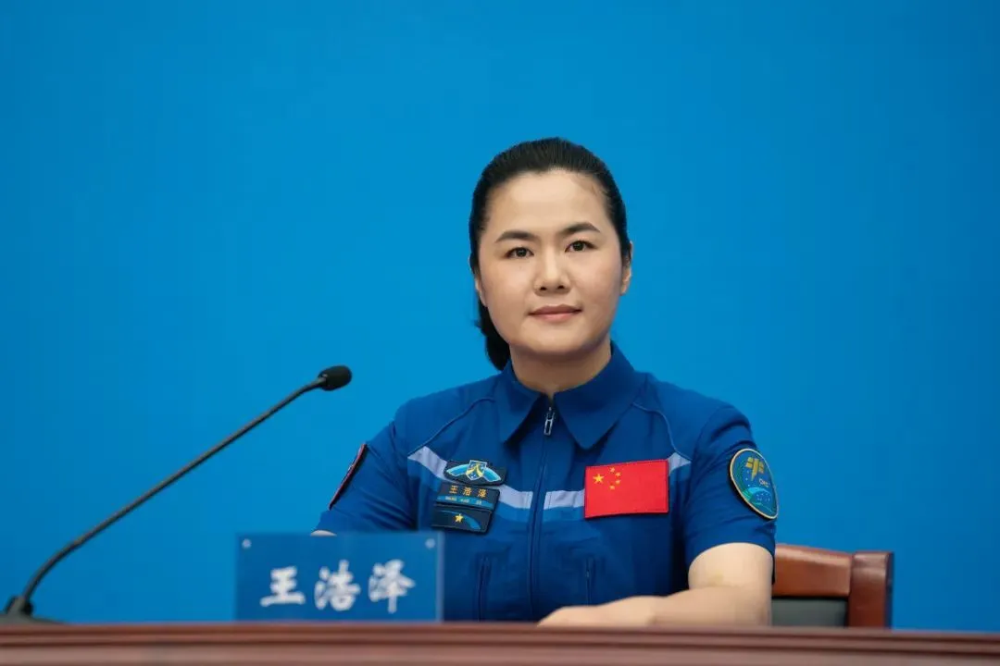

# 王浩泽

## 标准照

## 标准简历

王浩泽，女，满族，籍贯河北滦平，硕士学位。1990年3月出生，2021年1月入伍，2009年12月加入中国共产党，现为中国人民解放军航天员大队四级航天员，陆军中校军衔。曾任中国航天科技集团有限公司高级工程师。2020年9月入选为我国第三批航天员。经全面考评，入选神舟十九号载人飞行任务乘组。

## 人物经历

### 成为航天员之前

1990年3月，王浩泽出生于河北滦平，从小热爱读书，成绩优异。
2005年，王浩泽以全县第二名成绩考入唐山市第一中学，其高中时期成绩一直很好，且注重全面发展，坚持运动，为日后成为航天员打下坚实基础。
2008年，王浩泽本科入读于东南大学能源与环境学院能源动力工程专业。
2009年12月，加入中国共产党。
2012年，以成绩年级排名第一的身份保送研究生，在东南大学师从顾璠攻读热能工程研究生。

2015年，获得东南大学热能工程硕士学位。毕业后，王浩泽把简历投向中国航天科技集团。
2015年，王浩泽进入北京航天动力研究所，从事新型火箭发动机总体设计任务。
翌年，迎来科研工作中的大挑战：微通道换热器的设计工作，面对从来没有接触过的换热器设计，她查阅多方资料，对比多个公式，攻克难关，完成了高效紧凑式微通道换热器设计的程序编写。

### 成为航天员之后

2020年9月，王浩泽入选中国第三批航天员，后经全面考评，入选神舟十九号载人飞行任务乘组。
2021年1月，参军入伍。
2023年，被选入神舟十九号乘组，和蔡旭哲、宋令东一起执行任务。
2024年10月，经空间站应用与发展阶段飞行任务总指挥部研究决定，执行神舟十九号载人飞行任务的航天员乘组由蔡旭哲、宋令东、王浩泽3名航天员组成，蔡旭哲担任指令长。
2024年10月30日4时，搭载神舟十九号载人飞船的长征二号F遥十九运载火箭在酒泉卫星发射中心点火发射，约10分钟后，神舟十九号载人飞船与火箭成功分离，进入预定轨道，王浩泽等航天员乘组状态良好，发射取得圆满成功。
2024年11月30日，神舟十九号乘组蔡旭哲、宋令东、王浩泽三名航天员“太空出差”一个月以来，多项空间科学实试验并行开展。

2025年1月21日1时12分，经过约8.5小时的出舱活动，神舟十九号乘组航天员蔡旭哲、宋令东、王浩泽密切协同，在空间站机械臂和地面科研人员的配合支持下，完成了空间站空间碎片防护装置安装、舱外设备设施巡检等任务。

2025年4月30日13时08分，神舟十九号载人飞船返回舱在东风着陆场成功着陆，现场医监医保人员确认航天员蔡旭哲、宋令东、王浩泽身体状态良好，神舟十九号载人飞行任务取得圆满成功。

## 记者见面会

记者：请问王浩泽，作为我国首位女性航天飞行工程师，盘点执行此次完成任务的清单，怎么评价自己的太空“首秀”？

王浩泽：感谢你的提问。本次任务是我和宇宙的第一次相约。我还记得，刚进入太空家园时那种强烈的震撼感。站里明亮干净，系统精密复杂，那一刻，我由衷地为我们的祖国感到骄傲，为自己是一名航天人感到骄傲。本次任务中，我们乘组一心、天地一体，圆满完成了3次出舱任务、多项空间科学试（实）验任务、站务管理以及物资管理等工作。每次操作前，我都告诉自己要慢下来，保安全；往细做，保成功。在天上，想要把活干好，还得沉得下心，耐得住磨。比如，物资管理工作，首先需要对全站的所有物资有一个全局性的把握，然后规划好每一次的物资管理任务，登记好每一件产品的每一个细节，这样才能确保将任务做到精准有序、万无一失。在太空的183个日日夜夜，我们就这样全心全意地爱着我们的空间站，爱她的每个舱段、每一项实验、每一个设备，这不仅是我们的家，也是千千万万航天工作者的“太空家园”。我也期待着早日重返太空，再次回到我们的太空家园，再次将光荣和梦想写满太空！

记者：请问王浩泽，您承担了哪些空间科学与应用载荷在轨实(试)验？都有哪些收获？

王浩泽：造船为建站、建站为应用。本次任务的在轨实（试）验，涵盖了空间生命科学、微重力基础物理、空间材料科学、航天医学、航天新技术等领域，承载着许多科研人员的智慧、心血和汗水。我们共参与实施了88项空间科学实验任务，6次载荷进出舱任务。其中，大约有一半的实验都是空间站首次开展的新实验。目前，这些项目都取得了阶段性成果。我还记得在天地同心的共同守护下，果蝇家族在太空中实现了的“三世同堂”；在轨期间，我们还和智慧助手“小航”进行了亲密互动，此外，我们还对空间管道机器人进行了测试和验证。作为一名飞行工程师，能够切身地体会到科学研究的来之不易，因此，对每一项实验都格外珍惜。我们不仅仅是实验的操作者，更是把自己融入进了整个科研团队，天地携手、全力以赴地把实验做到最好，不辜负科研人员的付出和期待。我也相信在一代又一代航天人的努力下，我们的空间科学技术一定会不断突破，取得更多硕果。谢谢。

记者：请问王浩泽，作为一名女航天员，您在空间站如何发挥好自己的优势？另外，您在飞行前给大家分享了一首训练时的小诗，请问半年的生活，有没有新的作品分享给我们？

王浩泽：作为一名女航天员，在任务中要充分发挥自己的优势。队友们在总结复盘时也曾说到，女性工程师细腻的操作习惯、科学的思维方式、柔和的心理底色，都为整个乘组注入了新的能量。此外，在出舱任务中的在轨训练、机械臂操作等，尽管都富有挑战，但我依然信心满满地圆满完成了任务。能够为科学探索贡献更多力量，让世界看到更多的女性风采，我所作的一切努力都变得更加有意义。这半年的“太空出差之旅”丰富充实，也精彩难忘。难忘火箭升空时，看向地球的那惊鸿一瞥；难忘飞行中，看到祖国大地时的欢喜雀跃；难忘临别前，对窗外那片星空的恋恋不舍。闲暇时，我也喜欢看看书，写一写太空日记。世界读书日那天，我们乘组还共同写下了在太空读书的美妙。点点滴滴，都难以忘怀。返回时，我将内心的期盼写成了一首小诗。在这里也和大家一起分享一下：“《星河逐梦》：宇宙荡满星辰/一颗颗，一点点/像极了我心中的火焰/纵使星河之路神秘悠远/但我相信/星星之火可以燎原/我定会点燃更多的火把/照亮深远的太空/只因为/那片遥远的星空中/有我一生的梦。”最后，祝愿新时代的每一位奋斗者，都有梦可追，追梦可成。

## 中央军委表彰决定原文

暂无

