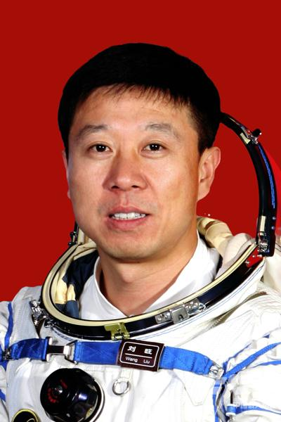

# 刘旺

## 标准照

## 标准简历

&nbsp;&nbsp;&nbsp;&nbsp;&nbsp;&nbsp;&nbsp;&nbsp;刘旺，男，1969年3月出生，山西平遥人，共产党员，硕士学位。 
&nbsp;&nbsp;&nbsp;&nbsp;&nbsp;&nbsp;&nbsp;&nbsp;刘旺1988年8月入伍，曾任空军某师某团某飞行大队中队长，安全飞行1000小时，被评为空军二级飞行员。经过多年的航天员训练，完成了基础理论、航天环境适应性、航天专业技术、飞行程序与任务模拟训练等8大类几十个科目的训练任务，以优异成绩通过航天员专业技术综合考核。2012年3月，入选神舟九号任务飞行乘组。2012年6月，圆满完成神舟九号任务，被授予“英雄航天员”称号。现为中国人民解放军航天员大队特级航天员，大校军衔。
## 人物经历

### 成为航天员之前

刘旺1988年8月入伍，曾任空军某师某团某飞行大队中队长，安全飞行1000小时，被评为空军二级飞行员。
### 成为航天员之后

2012年3月，入选神舟九号任务飞行乘组。
2012年6月，圆满完成神舟九号任务，被授予“英雄航天员”称号。
现为中国人民解放军航天员大队特级航天员，大校军衔。

## 记者见面会
  
&nbsp;&nbsp;&nbsp;&nbsp;&nbsp;&nbsp;&nbsp;&nbsp;今年６月２４日，神舟九号与天宫一号成功完成手动对接，这被称为“太空穿针”的杰作正是由刘旺缔造。当被同学们问及“穿针”前有多大把握时，刘旺的回答铿锵有力，“百分之百，也必须保证百分之百。”信心来自于实力。“中国载人航天经过２０年的发展历程。我们对航天技术有信心，对航天员有信心，我们要向世界展现中国航天技术是一流的、完善的。”刘旺说。谈到理想与成功，刘旺说：“之所以能实现理想，是因为经历了艰苦的过程，目标明确后，一天天地坚持就能使你离理想越来越近。等你成功时，回过头看一看，一切都很平常。” 
&nbsp;&nbsp;&nbsp;&nbsp;&nbsp;&nbsp;&nbsp;&nbsp;7月13日，航天员刘洋在北京航天城航天员公寓回答媒体记者提问。圆满完成天宫一号与神舟九号首次载人交会对接任务的航天员景海鹏、刘旺、刘洋，13日上午结束为期14天的隔离恢复期，在北京航天城航天员公寓与媒体记者见面并回答提问。为促进航天员身体恢复和重力再适应，从6月29日神舟九号返回当天起，3名航天员即开始了为期14天的隔离恢复。期间，中国航天员科研训练中心本着恢复措施与医学检查有机结合的原则，开展了动态医学检查与评估、心理和体质恢复训练、作息制度调整、合理营养调配、消毒检疫等5个方面的医监医保工作。通过14天的观察，证明隔离恢复措施合理、效果明显。目前，3名航天员重力再适应进展顺利，各项生理指标正常。“神舟九号报告：航天员景海鹏、刘旺、刘洋身心恢复状况一切正常，感觉良好！请大家放心，感谢全国人民对我们的支持和厚爱！” 
&nbsp;&nbsp;&nbsp;&nbsp;&nbsp;&nbsp;&nbsp;&nbsp;13日上午9时许，经过两周隔离恢复之后，神九航天员乘组3位航天员身着人们熟悉的蓝色工作服，神采奕奕地出现在记者面前。指令长景海鹏的报告，引发了全场热烈的掌声。 
&nbsp;&nbsp;&nbsp;&nbsp;&nbsp;&nbsp;&nbsp;&nbsp;这是圆满完成神舟九号与天宫一号首次载人交会对接任务之后，3位航天员首次与记者见面并讲述载人交会对接任务中鲜为人知的幕后细节。 
&nbsp;&nbsp;&nbsp;&nbsp;&nbsp;&nbsp;&nbsp;&nbsp;刘旺：“开飞船的感觉，很好！” 
&nbsp;&nbsp;&nbsp;&nbsp;&nbsp;&nbsp;&nbsp;&nbsp;刘旺说：“我亲身体验到开飞船的感觉，确实是得心应手，操纵自如，要问我的评价，就两个字，很好！” 
&nbsp;&nbsp;&nbsp;&nbsp;&nbsp;&nbsp;&nbsp;&nbsp;神舟九号与天宫一号首次载人交会对接任务中，刘旺担负着手控交会对接的操作任务。在景海鹏、刘洋的配合下，他出色完成了这一重要使命。 
&nbsp;&nbsp;&nbsp;&nbsp;&nbsp;&nbsp;&nbsp;&nbsp;“我在任务前，说有百分之百的把握完成任务，这与其说是诺言，不如说是信心。”刘旺说，“我相信经过长时间的训练，在前几次任务基础上的积累，再加上两位战友的帮助与协作，我们这次的突破，一定能成功实现。” 
&nbsp;&nbsp;&nbsp;&nbsp;&nbsp;&nbsp;&nbsp;&nbsp;“我的诺言和信心还来自于天宫和神舟。在天上，在天宫和神舟里，我感觉真的很好。”刘旺说。 
&nbsp;&nbsp;&nbsp;&nbsp;&nbsp;&nbsp;&nbsp;&nbsp;刘旺是我国培养的第一批航天员，进入中国人民解放军航天员大队已经14年。“这5000多个日日夜夜中，我实际上只做了一件事，就是在为实现自己的使命做准备。”刘旺说，“我相信只要坚持，终有所获。不管是做人还是做事，都会百炼成钢。”

## 中央军委表彰决定原文

### 神舟九号表彰决定

新华社北京１０月３日电

### 
中共中央 国务院 中央军委

### 
关于给景海鹏颁发“二级航天功勋奖章”

### 
授予刘旺、刘洋“英雄航天员”荣誉称号

### 
并颁发“三级航天功勋奖章”的决定

（２０１２年１０月１日）

 
&nbsp;&nbsp;&nbsp;&nbsp;&nbsp;&nbsp;&nbsp;&nbsp;２０１２年６月１６日，我国航天员景海鹏、刘旺、刘洋同志驾乘神舟九号载人飞船成功进入太空，在顺利完成与天宫一号目标飞行器自动交会对接和手控交会对接，并进入天宫一号圆满完成一系列科学实验后，于６月２９日安全返回地面。这次载人交会对接任务的圆满成功，实现了我国空间交会对接技术的又一次重大突破，标志着我国载人航天工程第二步战略目标取得了具有决定性意义的重要进展。这是建设创新型国家取得的新成就，是中国人民在攀登世界科技高峰征程上铸就的新辉煌，是中华民族为人类探索利用外层空间作出的又一卓越贡献，对于增强我国综合国力、振奋民族精神，鼓舞和激励全国各族人民奋力夺取全面建成小康社会新胜利、不断开创中国特色社会主义事业新局面，具有重大而深远的意义。 
&nbsp;&nbsp;&nbsp;&nbsp;&nbsp;&nbsp;&nbsp;&nbsp;天宫一号与神舟九号载人交会对接任务的圆满完成，凝聚着广大科技工作者、航天员、干部职工和解放军指战员的心血和智慧，景海鹏、刘旺、刘洋就是其中的杰出代表。他们忠诚使命、不畏艰险，刻苦训练、勇挑重担，沉着果敢、精心操作，团结一心、密切配合，出色完成了各项任务，建立了卓著功勋。为表彰景海鹏、刘旺、刘洋同志作出的卓越贡献，中共中央、国务院、中央军委决定，给景海鹏同志颁发“二级航天功勋奖章”，授予刘旺、刘洋同志“英雄航天员”荣誉称号并颁发“三级航天功勋奖章”。
 
&nbsp;&nbsp;&nbsp;&nbsp;&nbsp;&nbsp;&nbsp;&nbsp;中央号召，全党全军全国各族人民要以景海鹏、刘旺、刘洋同志为榜样，学习他们忠诚于党、矢志报国的坚定信念，学习他们不畏艰险、敢为人先的探索精神，学习他们严谨细致、精益求精的科学作风，学习他们勇攀高峰、争创一流的顽强斗志，努力在本职岗位上建功立业。
 
&nbsp;&nbsp;&nbsp;&nbsp;&nbsp;&nbsp;&nbsp;&nbsp;让我们紧密团结在以胡锦涛同志为总书记的党中央周围，高举中国特色社会主义伟大旗帜，以邓小平理论和“三个代表”重要思想为指导，深入贯彻落实科学发展观，大力弘扬“两弹一星”精神和载人航天精神，自强不息、团结拼搏，开拓创新、扎实工作，不断创造新的业绩，为加快推进改革开放和社会主义现代化、为实现中华民族伟大复兴而不懈奋斗！
