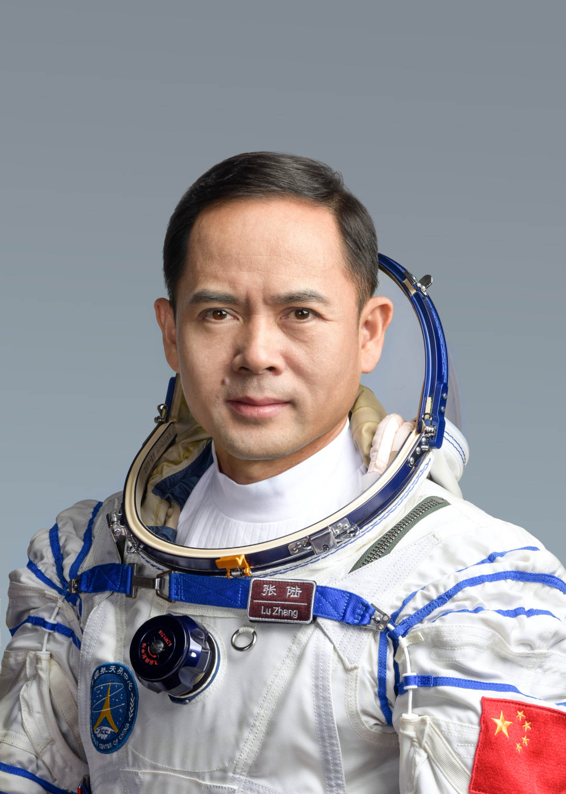

# 张陆

## 标准照

## 标准简历

​    张陆，男，汉族，籍贯湖南汉寿，中共党员，硕士学位。1976年11月出生，1996年8月入伍，1999年4月加入中国共产党，现为中国人民解放军航天员大队二级航天员，大校军衔。曾任空军某训练基地某团司令部空战射击主任，被评为空军一级飞行员。2010年5月入选为我国第二批航天员。经全面考评，入选神舟十五号载人飞行任务乘组。2022年11月29日，神舟十五号载人飞船成功发射，航天员费俊龙、邓清明、张陆驾乘飞船顺利进驻天和核心舱，在轨驻留6个月，先后进行4次出舱活动，开展一系列空间科学实验与技术试验，圆满完成空间站组合体各项运行管理任务，于2023年6月4日安全返回。

## 人物经历

### 成为航天员之前

张陆曾就读于汉寿县城关四小、詹乐贫中学、汉寿一中。

1996年，张陆考入中国人民解放军空军长春飞行学院。

1999年，张陆加入中国共产党。

2000年，张陆从空军第七飞行学院毕业，成为一名强五攻击机飞行员。

2010年5月，飞行员张陆经过层层选拔，进入中国人民解放军航天员大队，与刘洋、王亚平、陈冬、汤洪波、叶光富、蔡旭哲一道，成为中国人民解放军第二批航天员。

### 成为航天员之后

2018年1月，张陆与中国人民解放军航天员大队成员一起被中宣部授予“时代楷模”荣誉称号。

2020年，张陆晋升大校军衔。

2022年11月，张陆经全面考评，入选神舟十五号载人飞行任务乘组。

2022年11月29日23时08分，张陆搭载神舟十五号载人飞船的长征二号F遥十五运载火箭在酒泉卫星发射中心点火发射。

2022年11月30日7时33分，张陆与其它两名航天员进驻中国空间站，与神舟十四号航天员乘组首次实现“太空会师”。

2023年2月10日00时16分，神舟十五号航天员费俊龙、邓清明、张陆密切协同，经过约7小时的出舱活动，完成出舱活动全部既定任务。

2023年3月2日，在地面工作人员和舱内航天员邓清明的密切配合下，张陆进行第二次出舱活动，完成全部既定工作任务，安全返回问天实验舱。

2023年3月30日，神舟十五号航天员乘组进行了第三次出舱活动。

2023年4月15日，神舟十五号航天员乘组进行了第四次出舱活动。

2023年6月3日21时29分，神舟十五号载人飞船与空间站组合体成功分离。分离前，神舟十五号航天员乘组在地面人员的配合下，完成了空间站组合体状态设置、实验数据整理下传、留轨物资清理转运等撤离前各项工作，与神舟十六号乘组完成了工作交接。

2023年6月4日6时33分，神舟十五号载人飞船返回舱在东风着陆场成功着陆，现场医监医保人员确认航天员费俊龙、邓清明、张陆身体状态良好，神舟十五号载人飞行任务取得圆满成功。

2023年6月4日7时9分，神舟十五号航天员费俊龙、邓清明、张陆全部安全顺利出舱，健康状态良好。

2023年9月7日，中共中央、国务院、中央军委授予张陆“英雄航天员”荣誉称号并颁发“三级航天功勋奖章”。

2023年10月1日，张陆获得“英雄航天员”荣誉称号喜报和“英雄航天员之家”牌匾。

### 记者见面会

#### 神舟十五号新闻发布会

**问：请问张陆，神舟十五号与神舟十四号两个航天员乘组在空间站实现首次在轨轮换，你们在轨见证了首次“太空会师”，在空间站见到队友有何感受？**

**张陆：**我们神舟十五号与神舟十四号的“太空会师”是中国载人航天的首次，在这次“太空会师”中，对我来说，印象最深的应该是亲如家人一般的情谊。我记得当我们神舟十五号的飞船轨道舱舱门打开的那一瞬间，站在舱门的另一端迎接我们的就是神舟十四号的队友，这让我们非常地感动。我觉得当时温暖的不仅仅是拥抱，甚至连舱里的灯光都是温暖的。在这里我要特别感谢神舟十四号的三位队友，因为他们为了我们的到来付出了很多：他们为我们准备好了可口的早餐，为我们准备好了更换的衣服，甚至连我们睡眠区都做了精心的布置。在神舟十四号三位队友的帮助下，我们也很快适应了失重，熟悉了舱内的环境。同样我们也为神舟十四号的三位战友送上了我们准备的礼物，包括音乐、相框，还有睡眠宝等等。这一些温暖的回忆到现在想起来都让人感觉到甜蜜。神舟十四号三位战友传递给我们的这种关爱，我们也传递给了神舟十六号。这种浓厚的情谊，它是一种生死与共的相互信任，更是载人航天精神的传承和接续。谢谢。

**问：请问张陆，在您的第一次太空之旅中，您觉得哪个瞬间让自己印象最为深刻，最大的收获是什么？后续有什么打算？**

**张陆：**神舟十五号任务是我的第一次太空之旅，在这次任务中，对我来说，最难忘的应该是出舱，因为在出舱之前我们都是通过舷窗那个小小的窗口向外去观察，观察空间站外面的世界，看不全。当我第一次站在舱外，整个太空净收眼底的时候，我便震撼到了，我感叹于自然的神奇、宇宙的浩瀚，在指令长01的带领下，我们神舟十五号共执行了4次出舱任务，每次任务不同，心情也不同。“眼有星辰大海，胸怀赤胆忠心”，4次出舱让我对事业、对使命有了更深的感悟，这也是我想和大家共同分享的我最深的感悟。说到这次任务的收获，有两点：第一就是家国情怀，这一点是从我的指令长01身上所看到的，因为从神舟六号到神舟十五号，时隔17年再次出征太空，指令长01真正做到了为国家尽责、为民族尽力、为事业尽心，这是一种博大的家国情怀；第二是梦想与坚持，这一点是从02身上所看到的，因为为了这次任务02坚守了25年，这份坚守的毅力值得我们每个人去学习，虽然神舟十五号任务已经结束，但是我会把从两位老大哥身上展现出来的这种精神传承下去，谢谢。

**问：请问张陆，您在返回时，曾说的一句话，感动了很多人。您曾说，您一次次在舷窗边眺望，眺望祖国，眺望家乡，眺望家乡的那汪洞庭湖，尽管云层遮住了您的视线，您总是看不太清楚，但是您知道，祖国一直在您心中，家乡一直在您心中。家乡的那汪洞庭湖，在您印象中，最深的画面是什么呢？**

**张陆：**家是最小国，国是千万家。在每个人的心里，家乡都是深深牵挂。家国情怀，是刻在我们骨子里的情怀，承载着中华儿女千百年来对“家乡”的深厚眷念，更是对“国家”的绝对忠诚。在距离地球400公里的中国空间站，我们3个人时常眺望地球，寻找祖国，寻找彼此的家乡。我还清晰地记得，在我们执行第三次出舱任务时，我和指令长都在舱外作业，我们不约而同地看到中国空间站经过祖国的上空！我十分激动。那种感觉，那种激动，一直还深深地刻在我的心里。家乡的那汪洞庭湖，也是我心里割舍不去的牵挂。因为任务的需要，我已经有六年没有回家乡了，十分期待回一趟家乡，回到生我养我的地方，唤醒对家乡的美好记忆。

### 中央军委表彰决定原文

​                                                    **中共中央　国务院　中央军委**

​                                            **关于给费俊龙颁发“二级航天功勋奖章”**

​                                            **授予邓清明、张陆“英雄航天员”荣誉称号**

​                                                 **并颁发“三级航天功勋奖章”的决定**

2022年11月29日，神舟十五号载人飞船成功发射，航天员费俊龙、邓清明、张陆驾乘飞船顺利进驻天和核心舱，在轨驻留6个月，先后进行4次出舱活动，开展一系列空间科学实验与技术试验，圆满完成空间站组合体各项运行管理任务，于2023年6月4日安全返回。神舟十五号载人飞行任务是中国空间站建造阶段的决胜收官之战，首次形成空间站“三舱三船”最大构型，首次实现2个航天员乘组“太空会师”，刷新中国航天员单个乘组出舱活动次数纪录，标志着中国航天事业高水平科技自立自强迈出新步伐，加快建设航天强国实现新突破，对提升我国综合国力和增强中华民族凝聚力，激励全党全军全国各族人民坚定信心、保持定力，踔厉奋发、勇毅前行，奋力谱写中国式现代化新篇章，具有重要意义。

　　神舟十五号载人飞行任务的圆满成功，凝聚着广大科技工作者、航天员、干部职工、解放军指战员的智慧和心血。费俊龙、邓清明、张陆同志是其中的杰出代表，他们矢志报国、忠诚使命，坚韧执着、精诚团结，向世界展示了强大的中国精神、中国力量。费俊龙同志时隔17年再上太空并2次担任指令长，成为中国空间站全面建成后首位出舱活动的航天员。邓清明同志坚守25年飞天初心不改、执着追梦，出色完成一系列实验和试验任务。张陆同志12年如一日扎实训练，首次飞天即稳妥完成4次出舱任务。为褒奖他们为我国载人航天事业建立的卓著功绩，中共中央、国务院、中央军委决定，给费俊龙同志颁发“二级航天功勋奖章”，授予邓清明、张陆同志“英雄航天员”荣誉称号并颁发“三级航天功勋奖章”。

　　费俊龙、邓清明、张陆同志是不忘初心、牢记使命、献身崇高事业的时代先锋，是探索宇宙、筑梦太空、建设航天强国的标兵模范。党中央号召，全党全军全国各族人民要以习近平新时代中国特色社会主义思想为指导，全面贯彻党的二十大精神，以受到褒奖的航天员为榜样，深刻领悟“两个确立”的决定性意义，增强“四个意识”、坚定“四个自信”、做到“两个维护”，更加紧密地团结在以习近平同志为核心的党中央周围，大力弘扬“两弹一星”精神和载人航天精神，自信自强、同心同德，奋发有为、奋勇前进，为全面建设社会主义现代化国家、全面推进中华民族伟大复兴而团结奋斗！

