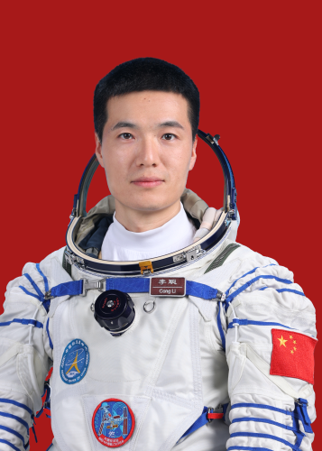
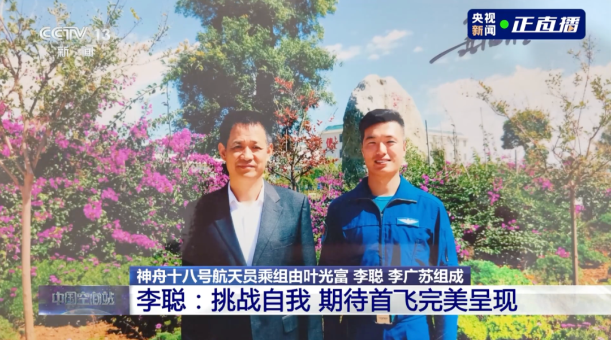
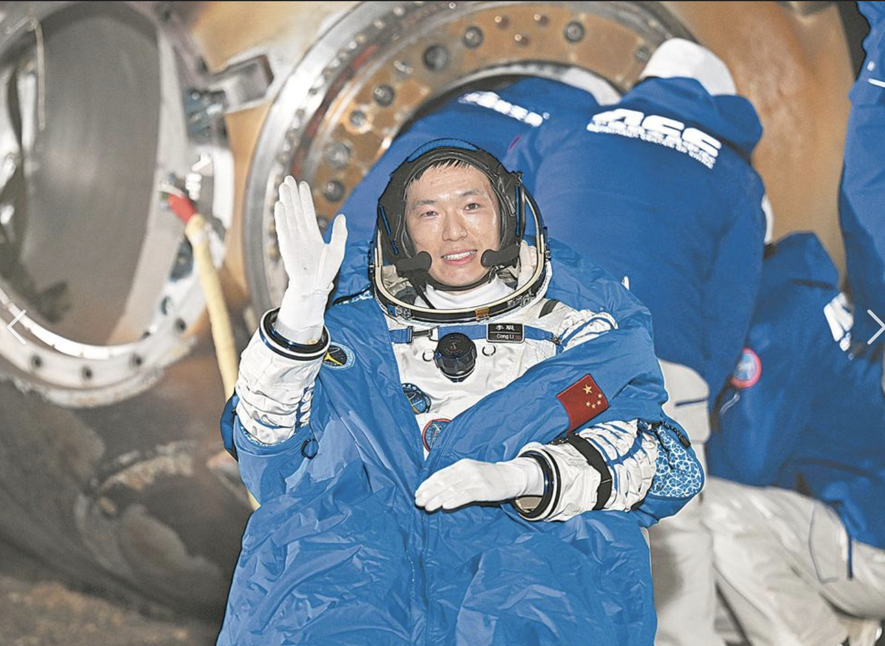

# 李聪

## 标准照

## 标准简历

李聪，男，汉族，籍贯河北邯郸，学士学位。1989 年 10 月出生，2009 年 9 月入伍，2011 年 6 月加入中国共产党，现为中国人民解放军航天员大队四级航天员，空军中校军衔。曾任空军航空兵某旅飞行大队副大队长，被评为空军二级飞行员。2020 年 9 月入选为我国第三批航天员。经全面考评，入选神舟十八号载人飞行任务乘组。

## 人物经历

### 成为航天员之前

李聪于 1989 年 10 月于河北邯郸出生。李聪儿时的梦想是成为一名歌唱家，但在高三时期，李聪第一次听说了“飞行员”，怀揣着对飞行员的憧憬和对蓝天的向往，李聪经过层层选拔，于 2009 年 9 月进入空军航空大学成为一名飞行学员，并于同年入伍。李聪于 2011 年 6 月加入中国共产党。在经历了一系列挑战和磨砺后，李聪成长为一位驾驶战机的空军飞行员。在 2018 年，李聪在参加航天员选拔的现场和聂海胜拍了张合影，在那一刻他觉得自己离航天梦越来越近。在经过层层选拔和复选后，2020 年 9 月，李聪入选我国第三批航天员。经全面考评后，入选神舟十八号载人飞行任务乘组。

#### 李聪与聂海胜合照

### 成为航天员之后

在经过三年的学习和训练后，李聪于 2024 年 4 月 24 日入选执行神舟十八号载人飞行任务的航天员团乘组，和叶光富、李广苏一起执行任务，是神舟十八号乘组中最年轻的航天员。4 月 25 日 20 时 59 分，搭载神舟十八号载人飞船的长征二号 F 遥十八运载火箭在酒泉卫星发射中心点火发射，约 10 分钟后，神舟十八号载人飞船与火箭成功分离，进入预定轨道。航天员乘组状态良好，发射取得圆满成功。在 2024 年 10 月 30 日与神舟十九号的航天员在“天宫”顺利会师。在 2024 年 11 月 4 日，神舟十八号航天员乘组乘返回舱在东风着陆场成功着陆。

#### 结束首次太空之旅

## 记者见面会

### 神舟十八号新闻发布会

记者：从加入航天员队伍到出征太空这一过程中，你经历了哪些磨练和准备？对于圆满完成这次任务你认为信心和底气来自哪里？

回答：谢谢您的的祝贺，更谢谢您的关注。从天空到太空，虽然只有一字之差，可是我们航天员都需要经历日复一日，年复一年的不断磨砺，都需要保持飞行和准备飞行两种状态。我们是幸运的，赶上了一个伟大的新时代。2020 年，我们第三批 18 名航天员光荣入选，正式踏上了为祖国出征太空的追梦征程。信之弥坚，行则愈远。三年多的时间里，我们得到了党组织的关怀培养，使我们充满了奋进的力量；我们还得到了全体教员的倾囊相授，无论是晚上还是节假日，都能及时解答我们的疑惑，陪伴我们加训加练，从思想、身心素质、专业技能等各个方面进行全方位的训练。乘组确定之后，在指令长的带领下，我们一方面向其他乘组学习借鉴有益经验，另一方面我们针对此次任务，重点围绕出舱活动、应急处置、站务管理、设备维护、实验操作等进行了全面、系统、深入的准备。我们有信心有能力圆满完成此次任务，谢谢。

## 中央军委表彰原文

### 神舟十八号表彰决定

2024 年 4 月 25 日，神舟十八号载人飞船成功发射，航天员叶光富、李聪、李广苏驾乘飞船顺利进驻天和核心舱，在轨驻留 6 个月，先后进行 2 次出舱活动，实施 6 次载荷货物气闸舱进出舱任务，完成 80 余项空间站建设升级维护维修任务，开展近百项空间科学实验与应用载荷在轨实（试）验，于 2024 年 11 月 4 日安全返回。神舟十八号载人飞行任务，是我国载人航天工程进入空间站应用与发展阶段的第三次载人飞行任务，刷新中国航天员单次任务连续在轨飞行时长、单次出舱活动时间纪录，首次圆满完成我国在轨水生生态研究项目，实施国际上首次植物茎尖干细胞功能在轨研究，标志着中国航天事业高水平科技自立自强迈出新步伐，对提升我国综合国力和中华民族凝聚力，进一步增强全体中华儿女民族自信心和自豪感，激励全党全军全国各族人民团结奋进、砥砺前行，具有重要意义。

神舟十八号载人飞行任务的圆满成功，凝聚着广大科技工作者、航天员、干部职工、解放军指战员的智慧和心血。叶光富、李聪、李广苏同志是其中的杰出代表，他们铁心向党、矢志报国，锐意进取、团结协作，向世界展示了强大的中国精神、中国力量。叶光富同志时隔两年再上太空并担任指令长，成为我国首位累计飞行时长超过一年的航天员。李聪同志扎实训练、艰苦磨砺，光荣入选神舟十八号乘组，出色完成担负任务。李广苏同志沉着果敢、勇挑重担，首次出舱即圆满完成首次空间站空间碎片防护装置安装任务。为褒奖他们为我国载人航天事业建立的卓著功绩，中共中央、国务院、中央军委决定，给叶光富同志颁发“二级航天功勋奖章”，授予李聪、李广苏同志“英雄航天员”荣誉称号并颁发“三级航天功勋奖章”。

叶光富、李聪、李广苏同志是不忘初心、牢记使命、献身崇高事业的时代先锋，是探索宇宙、筑梦太空、建设航天强国的标兵模范。党中央号召，全党全军全国各族人民要以习近平新时代中国特色社会主义思想为指导，全面贯彻党的二十大和二十届二中、三中全会精神，以受到褒奖的航天员为榜样，深刻领悟“两个确立”的决定性意义，增强“四个意识”、坚定“四个自信”、做到“两个维护”，更加紧密团结在以习近平同志为核心的党中央周围，大力弘扬“两弹一星”精神和载人航天精神，奋发进取、守正创新，再接再厉、乘势而上，为以中国式现代化全面推进强国建设、民族复兴伟业而团结奋斗！
