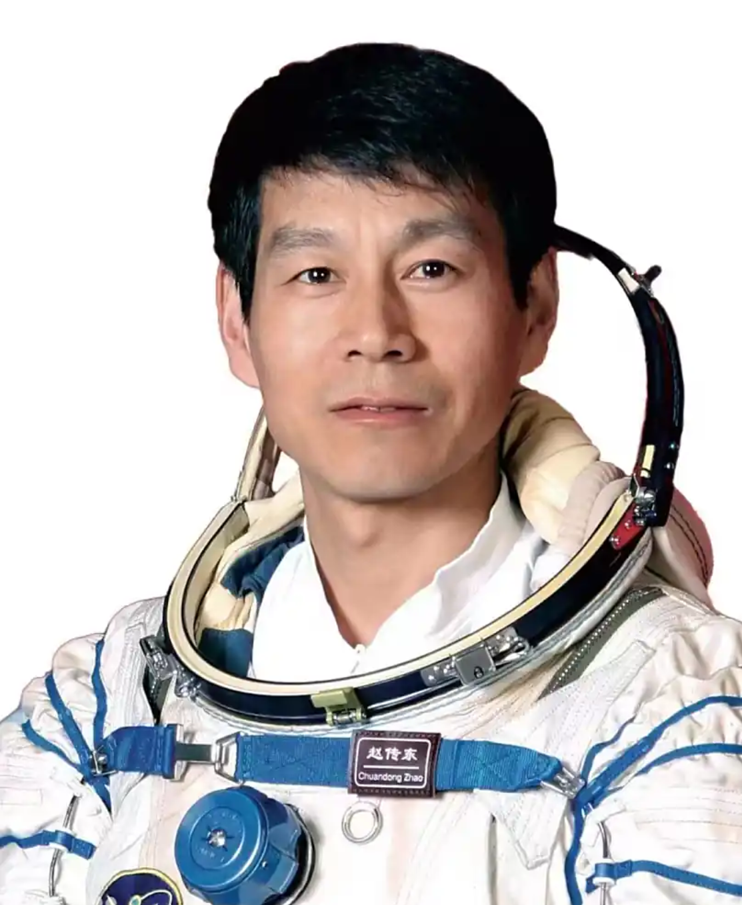
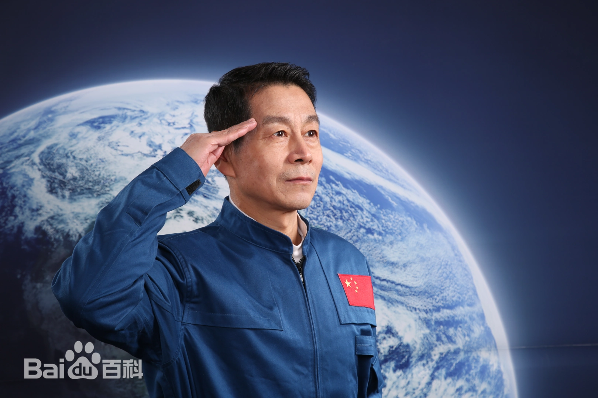
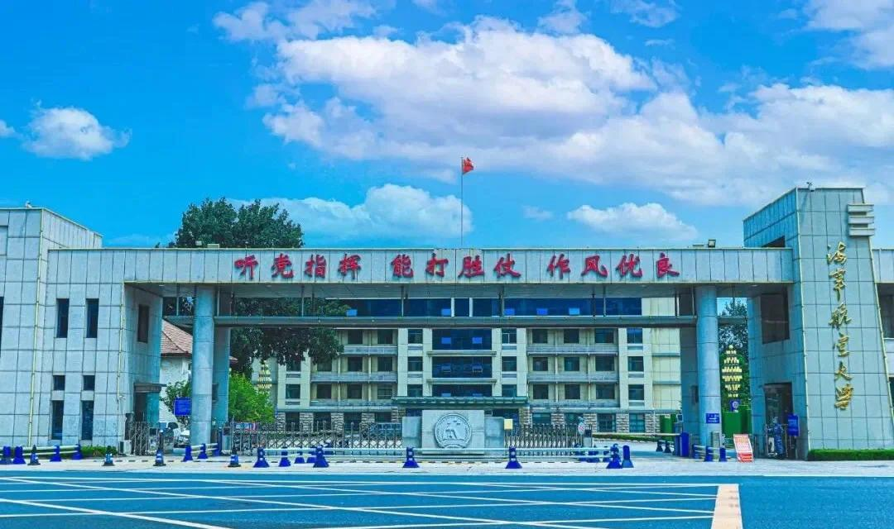

# 赵传东

## 基本信息

**姓名**：赵传东

**性别**：男

**国籍**：中国

**出生日期**：1963年

**出生地**：辽宁省葫芦岛市（今海军航空学校大院内）

**家庭背景**：

​	他的父亲曾经是一名飞行学员，海军航空学校毕业后留校任教，从事飞行教学工作，之后又从事飞行管理工作。在赵传东的成长道路上，父亲既是慈父，又是严师，更是益友。繁忙工作之余，父亲总会给赵传东讲述和飞行有关的故事，甚至用军人的标准来对他的日常生活起居作出严格要求。

​	或许是父亲的言传身教，赵传东自幼便对飞机和蓝天充满了向往。因为住在航空院校机场附近，赵传东得以有机会近距离观摩学员们飞行训练。天空中来回起飞降落的飞机以及发动机的轰鸣声，早已经如烙印般刻进了他的童年，成为他生命中不可缺少的一部分。他常常去参加或者观摩学员们的飞行演练，憧憬着未来自己也能够如雄鹰般展翅翱翔。

## 教育背景

**1981年6月**：进入长春空军第一飞行预备基础学校（现空军航空大学），最终毕业时可被授予优等生荣誉称号。那一届，学校当期只有两人毕业时获得了这个称号，其中一个就是赵传东。

**后续深造**：获清华大学航天工程领域工程硕士学位

## 工作履历

- **飞行员阶段（1980s-1998）**

  - 服役于北空某师，在十六年的飞行生涯中，赵传东先后飞过初教6、歼5、歼6和歼8，总飞行时间达到了1500小时，被评为“空军一级飞行员”。

- **航天员阶段（1998-2014）**

  - 1998年1月入选中国首批14名航天员，参与神舟五号至神舟十号任务训练及备份支持。

    

- **退役后（2014至今）**

  **2014-2018年**：任航天员系统副总工程师，研究航天员医学保障、恢复训练等课题。
  
  **2019年5月-2021年12月**，担任 [北京九天未来科技发展有限公司] 首席航天科普顾问。
  
  2023年，受邀成为科普**中国航空航天**领域专家。

## 工程贡献

1. **载人航天任务支持**
   - 全程参与**神舟五号**至**神舟十号**的地面训练、技术验证及备份任务，保障**出舱活动、交会对接**等关键技术实施。
2. **科研管理**
   - 在退出了现役航天员队伍后，他担任**航天员系统副总工程师**一职，为了适应这一新角色，他边学边干，深入调查研究。他主持了航天员医学监督体系优化，提出**空间任务后身体恢复方案**，提升长期航天健康保障能力。
3. **科普卫星工程**
   - 2024年担任中国青少年科普卫星工程“**八一04星**”项目顾问，指导卫星研发与测控站建设。

## 技术专长

- **航天训练技术**：超重离心机（8G耐受）以“**从未按下暂停按钮**”的坚韧意志成为训练标杆、失重环境模拟、前庭功能训练等极限适应性训练。
- **低空经济研究**：聚焦产业布局与技术应用，推动航空航天与 **鄂尔多斯市** 的区域经济融合。

## 代表成果

- **训练体系优化**：制定**《航天员恢复训练标准》**，提升任务后健康管理效率。
- **科普教育项目**
  - 主导“**点亮梦想**”火箭设计活动，纳入中国探月工程创意库。
  - 在全国开展**超500场**航天讲座，覆盖青少年超**10万**人次。

## 荣誉称号

- 荣立**二等功1次**、**三等功2次**（表彰航天训练贡献）。
- 《人民日报》评价：“**到退役也未曾飞天的航天英雄，值得鲜花和掌声**”。

## 人物语录

“**战友飞，就是我在飞。团队的荣耀就是我的荣耀！**” —— 回应未飞天遗憾。

“**探索宇宙中，每一个人都可以用自己的方式丈量宇宙。**” —— 科普讲座寄语青少年。
“**仰望星空，脚踏实地，勇于探索，不懈努力，定能实现梦想！**” —— 2021年“**点亮梦想广州站**”活动演讲

## 备注

**未飞天原因**：因任务次数限制及年龄因素，2014年退出现役航天员序列，但始终以备份角色支持团队。

**精神象征**：以“功成不必在我”的奉献精神，成为载人航天工程中“幕后英雄”的典型代表。

**最新动态（2025年）**：赵传东至今在多地举办公益课，宣讲航天精神与低空经济前沿。

***

**资料来源：**

【人物风采】**筑梦苍穹 我心飞扬——记原首批航天员、农大路军休所军休干部赵传东**（农大路军休所 张甫安）[https://m.sohu.com/a/808714015_121106842/?pvid=000115_3w_a]

**中国青少年科普卫星工程“八一04星”（哈尔滨号）正式启动**（哈尔滨市教育局）

[https://jyt.hlj.gov.cn/jyt/c110477/202405/c00_31737510.shtml]

**我校 ( 鄂尔多斯应用技术学院 ) 举办航空航天和低空经济科普公益课**(秦宇琪)[https://xcb.oit.edu.cn/info/1027/80184.htm]

**新民周刊（第14版：封面报道）**[https://paper.xinmin.cn/html/xmzk/2022-02-28/14/27388.html]

**百度百科词条”赵传东“**[https://baike.baidu.com/item/%E8%B5%B5%E4%BC%A0%E4%B8%9C/56490?anchor=4&fragment=4#4]