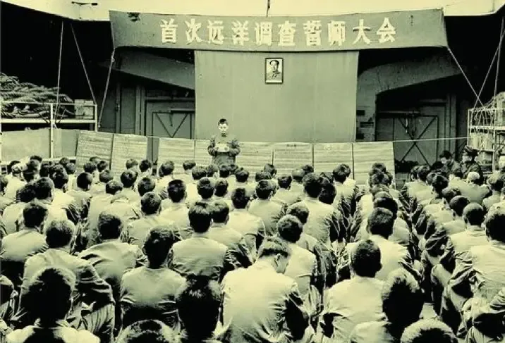
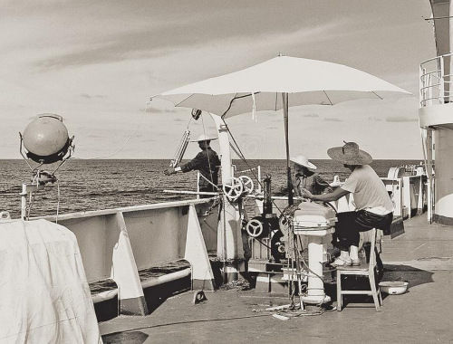
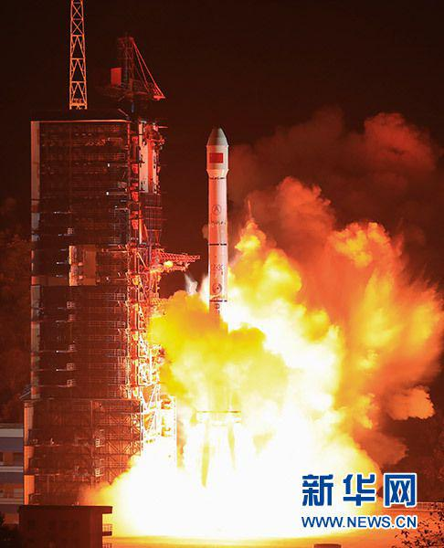

# 1976年
## 1月
**一月二十八日：** 国防科委提请国家海洋局安排东风五号洲际导弹全程试验海域选择的调查任务。  
**一月三十一日：** 国务院、中央军委常规装备发展领导小组正式下发《国发〔1976〕20号文》，对海鹰一号舰舰导弹设计定型给予最终批复，并同意转入小批量生产。
## 2月
**二月五日：** 国防科委、七机部联合下发《1976年航天型号质量整顿计划》（档号GF-Q-76-0205），提出“把可靠性放在首位”，为后续风暴一号甲两次成功发射奠定质量基础。
## 3月
**三月十五日：** 国防科委、空军、成都军区在川黔两省交界组织120km×60km落区实地勘察，确认12个主备回收场，并首次为落区配备“直-5＋米-8”混合搜救分队。  
**三月十二日：** 长征三号运载火箭氢氧发动机全系统四机并联试车获得基本成功。  
**三月三十一日：** 国家海洋局派出向阳红一号远洋考察船第一次出海考察东风五号全程试验落区海域  

[1976年3月30日，“向阳红五号”启航时，船舱内，一场特殊的誓师大会正在举行。各部门代表依次宣读决心书，个人代表纷纷发言，立志完成任务，掌声与口号声震得舱壁嗡嗡作响。]
  
[船上随军记者郭子芳拍摄]
## 4月
**四月十三日：** 海军军工产品定型委员会将新研制的海鹰二号降高弹命名为海鹰二号乙。  
**四月二十八日：** 三机部一一一厂研制成功我国第一台立式胶体磨。
## 5月
**五月十五日：** 东风四号增程遥测弹首次进行试验,获得成功。  
**五月十八日：** 为促进科研、生产与使用单位之间的合作,国务院、中央军委决定，在国防科委成立“331”工程领导小组，小组办事机构设在国防科委,负责整个工程的规划、计划、组织协调和督促检查工作,并设立“331”工程技术协调组,负责整个工程大总体技术协调工作。  
**五月二十日：** 西安卫星测控中心15m天线改造竣工，原12m口径S-波段雷达完成“15m主反射面＋副面”扩建，跟踪灵敏度提高4dB，为12月返回式卫星任务提供更长弧段测控。
## 6月
**六月十二日：** 国务院、中央军委联合发文，正式将江南造船厂在建的两艘远洋测量船命名为 “远望1号”“远望2号”，并成立“远望基地筹建指挥部”。
## 7月
**七月二日：** 国防工办发出通知,决定先将地空和海防导弹专业厂、所,移交给八机总局管理或归口:三机部移交给八机总局管理的单位有〇六一基地、一三九厂、一一一厂、一一九厂、七一九厂、陕西凤翔原六〇三所基地(后未归建);三机部移交八机总局归口的单位有上海机电二局所属战术导弹生产线、辽宁省红缨五号地空导弹动员线、江西省六二〇单位海防导弹配套产品生产线;六机部移交八机总局管理的单位有三四九厂和二五四厂;六机部移交八机总局归口的单位有天津全红无线电厂和天津光学仪器厂。  
**七月八日：** 长征二号运载火箭首次全箭振动试验：七机部702所北京云岗试验站完成CZ-2全箭一阶纵向振动模态试验，测得基频8.4Hz，为12月7日发射前最后一次结构动特性验证。  
**七月十五日至八月十二日：** 国防科委在北京召开331工程总体设计协调会,确定运载火箭用长征二号乙,即一、二级用东风五号,运载火箭第三级采用氢氧发动机二次启动方案,常规推进剂三级火箭作为备案继续研制。
## 8月
**八月二十五日：** 东风四号增程遥测弹再次试验获得成功。  
**八月三十日：** “技术试验卫星3号”成功发射，发射时间与地点为8月30日13时00分，酒泉卫星发射中心138工位。运载火箭与卫星参数为：风暴一号甲（FB-1A）两级液体运载火箭；卫星重1108kg，轨道参数173km×483km、倾角69°。其任务特点为：一、首次在卫星上搭载国产CCD相机，进行可见光-近红外遥感试验；二、首次验证“卫星-地面”双通道数传体制，为1977年返回式卫星改进型打下技术基础。

## 9月
**九月三日：** 国务院、中央军委正式批转了国防科委《关于战术导弹研制“五五”规划（1976—1980）的报告》，这份批件标志着中国第一个系统化的“战术导弹五年规划”生效，  
**九月八日：** 炮兵和八机总局联合提出近程地地战术导弹的研制方案:最大射程为800千米,最小射程为300千米;1976年开始研制,1980年定型并装备部队;代号为东升五号。  
**九月十四日：** “尖兵一号02星”正样星总装评审通过：北京卫星制造厂召开5天封闭评审，钱学森、任新民出席，确认星-箭接口、回收程序、防热结构38项关键指标合格，准予出厂。
## 10月
**十月二十五日：** “返回式卫星胶片判读楼”竣工交付，北京遥感信息研究所（代号507所）新建4层胶片判读楼通过竣工验收，安装国内首台国产1:50000精密立体测图仪，为12月回收的30kg胶片提供快速处理条件。
## 11月
**十一月三日：** “东风-5 全程试验测量总体方案”第一次讨论会：国防科委23基地在上海召开3天会议，首次把1980年南太平洋洲际导弹全程试验的测控任务分解到远望船、海外跟踪站和国内深空站，形成《全程测量总体方案（草案）》。  
**十一月二十日：** 北京卫星制造厂完成返回式卫星“第四状态”总装评审（厂档案 BSM-76-1120），标志着中国首次采用“批产”思路同时准备两颗同型号卫星。
## 12月
**十二月一日：** 船体完工后第93天，在江南造船厂3号码头完成8°静水横倾试验，为“远望1号”首次系泊倾斜试验实测初稳性高1.48m，满足远洋测控稳性要求。  
**十二月七日：** 在酒泉138工位（南发射区），长征二号运载火箭（CZ-2A）成功地将第三颗返回式卫星，即返回式遥感卫星2号（对外曾用名“尖兵一号02星”，官方内部序号“3-04”）准确送入预定轨道。  
  
[长征二号运载火箭（CZ-2A）]  
**十二月十日：** 第三颗返回式卫星按预定回收计划返回地面，在四川遂宁回收，所拍图像清晰，标记齐全，分辨率较好。  
**十二月二十日：** 中科院“651”月球小组在北京友谊宾馆召开三天封闭会议，为中国首次深空探测论证会，论证“绕月卫星”技术途径，提出1985年前发射100kg级月球轨道器的“两步走”设想（后演变为嫦娥工程前期论证）。
