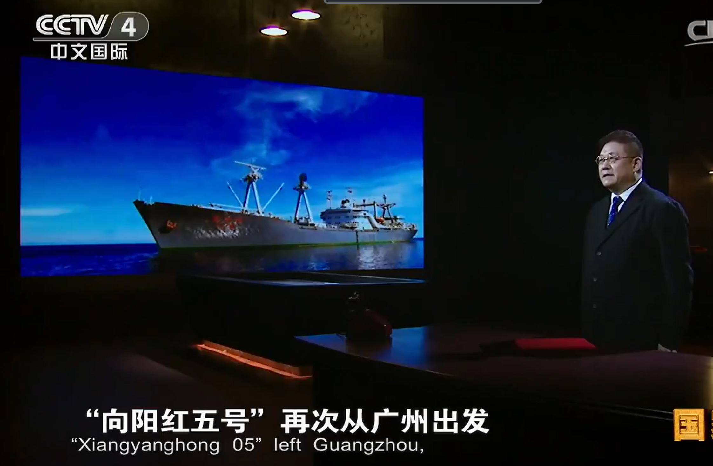
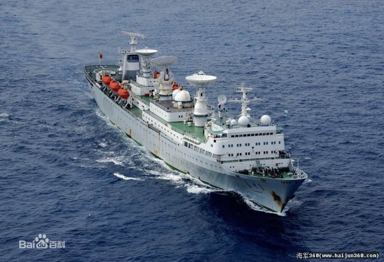
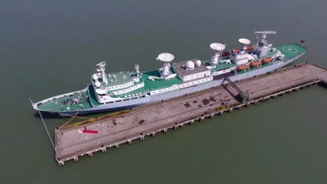
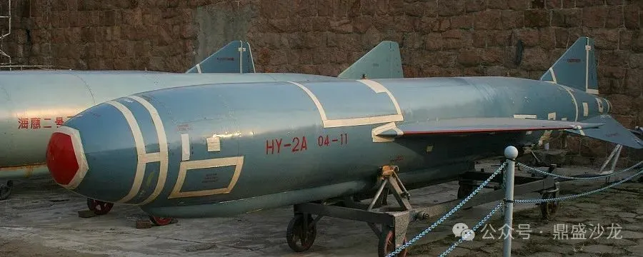

# 1977年
## 1月
**一月二十七日：** 七机部党的核心小组向党中央报告，请求派工作队进驻部、院、厂所,组成临时领导班子,领导全面工作,拨乱反正,恢复科研生产秩序。  
**一月二十九日：** 中央同意七机部党核心小组的请求。
## 2月
**二月七日：** 华国锋、叶剑英和国务院、中央军委领导在听取国防科委计划座谈会汇报时指示:东风五号洲际导弹要从实际出发,集中力量打歼灭战;通信卫星在国际电联登记,要五年内争取搞出来。
## 3月
**三月七日：** 中央派出由四个省市和军队选调的三百六十多名干部组成的工作队进驻七机部在京单位，帮助七机部进行整顿,党的各级组织机构得到恢复。  
**三月八日：** 国际电信联盟公布了中国通信卫星登记资料,并宣布了中国执行卫星通信工程的计划。  
**三月九日：** 七机部向党中央、国务院请示,建议七机部在京的大部分企事业单位实行北京市与七机部双重领导,以北京市为主。  
**三月十六日：** 国防工办批准〇六一基地研制东升五号战术地地导弹。  
**三月至五月：** 中国向阳红五号远洋考察船圆满完成第二次出海考察任务。

## 4月
**四月：** 确定空舰导弹由轰六丁型飞机为载机,并命名为鹰击六号导弹。鹰击六号空舰导弹全长7.36米,弹径0.76米,翼展2.4米,最大射程105千米到150千米,有效射程25千米到100千米,巡航速度0.9马赫数,平飞高度70米到100米,单机载弹量二发,单发命中概率70%,在发射试验中,经受住了低温、低气压、振动和空气动力干扰等复杂环境的考验,达到了设计要求。
## 5月
**五月四日：** 国务院办公室通知,党中央、国务院批准了七机部3月9日提出的请示。北京市为此成立了对口办事机构(第二办公室),负责领导这些单位的党政工作和有关业务工作。  
国家无线电管理委员会向ITU提交《关于申请1550-1650MHz等频段用于中国航天测量船的函》，首次把中国远洋测控频率纳入国际频率登记总表。
## 6月
**六月八日：** 北京卫星制造厂101厂房完成第三颗返回式卫星（尖兵一号02星）整星级热真空试验，-20℃～+60℃ 4次循环，持续72h，为1978年1月再次发射做最后验证。
## 7月
**七月二十日：** “长征三号”液氢液氧上面级首次半系统试车：七机部101所北京云岗试车台完成YF-73氢氧发动机50s半系统试车，真空比冲425s，标志着我国首次突破液氢液氧发动机二次启动关键技术。
## 8月
**八月十二日至十八日：** 中国共产党第十一次全国代表大会在北京举行,任新民、沈绪榜、汪洋等代表出席会议。  
**八月三十一日：** 在江南造船厂3号船台，远望1号测量船下水，我国第一代综合性航天远洋测量船的首制船，满载排水量21250t，可在12级风下安全航行；船上集成C-波段单脉冲雷达、S-波段统一测控系统、激光测角仪等10余种精密设备，填补了我国远洋测控空白。

## 9月
**九月十日：** 钱学森向中央提交《关于1980年前进行全程试验的报告》。报告首次提出“以洲际导弹全程试验为牵引，完成远望船队、海外跟踪站、落区测量船的体系化建设”，被叶剑英、李先念圈阅同意，成为1980年5月18日东风-5全程试验的决策依据。  
**九月十八日：** 中共中央批准国防科委《关于1980年前战略导弹和人卫星及其运载工具研制安排的请示》（国防科委于9月16日向中央专委呈报该请示）,决定集中力量抓好洲际导弹、潜地导弹（由潜艇水下发射固体战略导弹）和通信卫星（“东方红2号”实验通信卫星）三项重点任务（简称“三抓”任务），计划1980年至1984年间完成向太平洋发射东风五号洲际导弹、由潜艇水下发射巨浪一号固体导弹,并发射东方红二号试验通信卫星,作为三项重点任务(即“三抓”任务),要求按期完成。其中巨浪一号潜艇水下发射固体导弹,任命程连昌副部长为总指挥,黄纬禄为总设计师。  
**九月二十九日：** 远望船远洋导航设备联调:远望1号船在江南造船厂码头首次进行“塔康-奥米加-卫星导航”三组合系统联调，24h内连续定位误差＜80m，满足远洋测控要求。
## 10月
**十月三日至十二日：** 中国宇航学会作为中国空间技术的学术团体，首次组团出席欧洲空间学术会议并赴法国考察空间技术。  
**十月六日：** 国防工办、外交部、外贸部联合向国务院提出了八机总局以“中国精密机械公司”名称对外的问题。  
**十月十日：** 陈锡联副总理批示同意八机总局以“中国精密机械公司”名称对外的问题。  
**十月十四日至二十七日：** 国防科委、七机部在北京召开有北京、上海、四川、陕西、江苏、内蒙古、湖南等有关省、市、自治区参加的专门会议,议定了三项重点任务的计划进度,确定了研制分工,提出了对三项任务实行统一设计、统一计划、统一管理的具体措施。会议指出,为确保计划的实现,要根据任务的需要,调整布局,调配技术力量,保持科技队伍的稳定,保证科技人员有充分的时间进行科研工作。会后,各有关地区、部门,把所承担的三项任务作为必保的国家任务,集中人力、物力、财力，展开了一场空前规模的科研攻关。  
**十月二十日：** 中共中央决定,宋任穷任七机部党组书记、部长。  
**十月二十八日：** 七机部通知,为适应空间技术对外交流的需要,要逐步地、有限度地对外开放一些单位,接待专业相近的外国科学家、工程技术人员。  
**十月三十日：** 在江南造船厂4号船台，远望2号测量船下水，其与1号船组成“姊妹船”，形成我国第一代远洋测量船队；两船均装有4.8m抛物面天线的大型测控雷达，可在7000km外对再入飞行器进行连续跟踪。

## 11月
**十一月十四日：** 国务院、中央军委决定成立中央军委科学技术装备委员会,统一领导国防科学技术和国防工业生产工作(第七机械工业部由其归口管理),张爱萍任主任委员,下设办公室,简称“军委科装办”,刘华清任主任。  
**十一月十五日：** 西安卫星测控中心（原渭南基地）完成18m口径 S-波段统一系统（USB）天线的安装调试，使国内对低轨卫星的跟踪弧段由25%提高到45%，实现地面测控网扩建。  
**十一月十七日：** 国防科委在上海召开气象卫星工程大总体方案论证会,将中国第一颗气象卫星命名为风云一号。经过反复讨论,综合各方面意见,采纳了国防科委建议,使用长征二号甲常规推进剂运载火箭发射风云一号气象卫星。  
**十一月十八日：** 中央军委秘书长罗瑞卿召集国务院有关部委开会，部署三项重点任务需各部委大力协同做好物资协作工作的问题。七机部提出的1053项关键缺料和科研外协项目,落实了656项。
## 12月
**十二月三日：** 国防科委召开长征三号总体方案论证会,明确七机部第一研究院和上海机电二局的研制分工:总体设计在第一研究院，上海派人参加;一、二级运载火箭由上海机电二局研制,三子级由第一研究院研制。  
**十二月二十一日：** 七机部召开研制东风五号誓师动员大会。宋任穷部长在讲话中指出:东风五号是三项重点任务里面最主要的一项,要限期完成。1978年是关键的一年,要把工作组织好,要实行岗位责任制。在谈到质量问题时指出,不管是设计质量、工艺质量,还是其他工作方面的质量,都是非常重要的。  
**十二月二十四日：** 海鹰二号乙自导弹进行首发飞行试验,因弹上电源发生故障而失败。  

**十二月二十五日至十二月三十日：** 在东海某海域，“远望”船队首次合练。其内容为：两艘远望船首次编队出海，完成了“对空目标联合跟踪—数据实时传输—中心计算机处理”全链路演练；为1978-1979年的多次运载火箭全程试验积累海上操作规程。  
**十二月二十八日：** 七机部决定,将长征二号乙运载火箭改名为长征三号运载火箭(代号“CZ-3”);将长征二号甲运载火箭(代号“CZ-2A”)改名为新长征三号运载火箭。  
**十二月：** 七机部召开计划会议作了精心部署,指出实现“三抓”的目标,是维护国家、民族利益之必需,是具有历史意义的大事。
