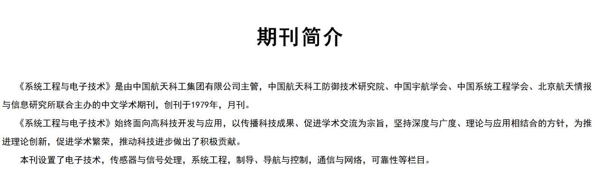

# 1979

## 7月
### 7月28日
风暴一号火箭携带3颗空间物理探测器从酒泉卫星发射基地起飞，但在滑行段飞行中游动发动机推力下降，最终火箭因飞行失衡自毁。

## 10月
中国宇航学会由钱学森、任新民、张震寰发起成立，其宗旨是团结和组织广大航天科技工作者，促进航天科学技术的快速发展，推动航天科学技术的普及与推广。

## 《国外空间动态》
《国外空间动态》1979年正式创刊，由中国航天科技公司主管，1996年更名为《国际太空》。

## 《系统过程与电子技术》
《系统工程与电子技术》由中国航天科工防御技术研究院、中国宇航学会和中国系统工程学会联合主办的学术期刊。

## 中国航天第三专业信息网
为适应空天推进技术发展的迫切需求，在聂荣臻元帅和张爱萍将军的倡导发起联合下，中国第一个空天推进技术邻域学术组织——中国航天第三专业信息网应运而生。