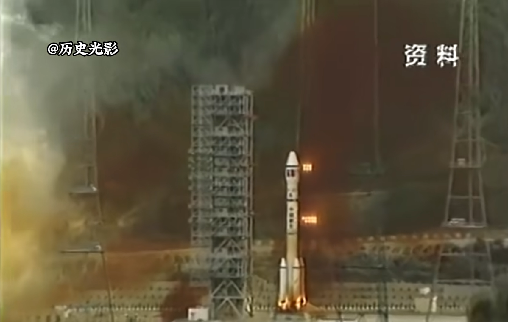
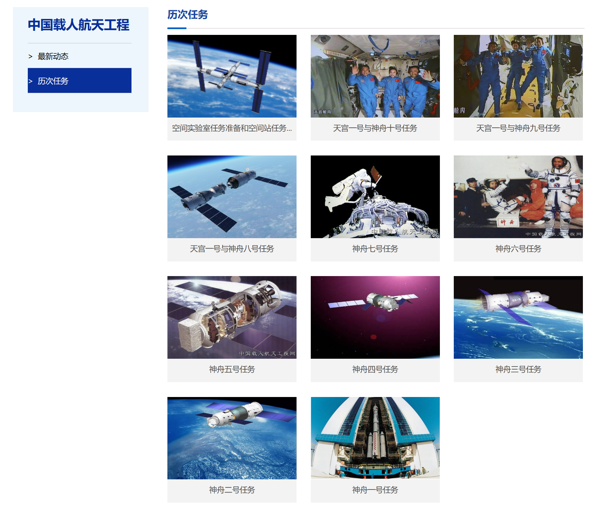

# 1992年

## 3月

**三月二十二日**:中国西昌卫星发射基地，携带**奥赛特B1通信卫星（澳星B1）**的**长征二号E（捆）Y2运载火箭**发射失利,发射控制中心立即启动应急预案，长征二号被紧急关机以确保安全。

发射失利画面：

但此时火箭在巨大推力作用下出现**偏移**，稍有不慎会发生**倾倒**。现场的专家在短时间内迅速作出决策，抢险队火速响应前往发射台进行救援，发射官兵也及时采取一系列补救措施，经过三十多个小时的不懈奋战，最后成功保护了**卫星**、**火箭**和**地面发射设施**。

当时的救援画面：

经调查，这场事故的原因是箭上程序配电器第三对触点之间有0.15毫克铝质多余物。
这次事故是中国航天事业的一次警钟，但也充分彰显了中国航天应对危急情况的处理能力。后来，航天工业总公司将这一天定为“航天质量日”。

## 8月

**八月九日**：长征二号丁运载火箭成功发射一颗新型返回式科学探测和技术试验卫星。8月25日，卫星顺利回收。

**八月十四日**：在中国航天人的努力下，1992.3.22事件中的**奥赛特B1通信卫星（澳星B1）** 通过 **长征二号E（捆）Y3运载火箭**成功被送入太空。

奥赛特B1成功发射的新闻报道:

从十八个月的火箭研制，到首发试飞成功，从322到814，中国航天人用不懈努力，将 ***理想的受挫*** 变为 ***圆满的成功***。

## 9月

**九月二十一日**:中央正式决策实施载人航天工程，并确定了我国载人航天 **“三步走”** 发展战略，代号为 **“921”工程**。

三步分别是:
* 第一步，发射载人飞船，建成初步配套的试验性载人飞船工程，开展空间应用实验；
* 第二步，突破航天员出舱活动技术、空间飞行器的交会对接技术，发射空间实验室，解决有一定规模的、短期有人照料的空间应用问题；
* 第三步，建造空间站，解决有较大规模的、长期有人照料的空间应用问题。

这一天起，中国航天人立志实现载人航天梦，筚路蓝缕三十载。
神舟也于这一刻起，从中南海启航。

载人航天工程历次任务（国家航天局发布）：

## 10月

**十月六日**：1992年10月6日14时20分，在中国酒泉卫星发射中心，长征二号丙火箭点火升空，成功发射，将中国**第14颗返回式卫星**送入太空，并同时搭载了瑞典的弗利亚卫星。

## 12月
 
**十二月二十一日**：携带 **奥赛特B2通信卫星（澳星B2）** 的 **长征二号E（捆）Y4运载火箭** 发射失利。12月21日，**长征二号E（捆）Y4运载火箭** 携 **奥赛特B2通信卫星（澳星B2）** 于西昌卫星发射中心发射“成功”，同时西安卫星测控中心传来卫星进入预定轨道消息，但是第二天，这颗价值1.38亿美元的卫星离奇失踪。
专家们想起，火箭发射后47秒左右出现过一个奇怪的 **“火球”**。
经过全面的调查分析后，专家认为火箭飞行47秒后，卫星发生爆炸，火箭的整流罩过早分离，但卫星和上面级残骸仍进入预定轨道。最终事故被认为中美双方协调不彻底，设计存有隐患，双方均应就此事采取措施，分别加强 **卫星** 和 **整流罩** 的设计。

卫星爆炸画面：

1994年8月28日，在中美双方共同努力下，加强了设计的**奥赛特B3通信卫星（澳星B3）** 和 **长征二号E（捆）Y5运载火箭**于西昌卫星发射中心发射成功。这引起了越来越多的卫星厂家和用户对“长二捆”的兴趣，且其采用的助推器分离技术大幅提高了运载效率，使日后的载人航天的实现成为可能。

**十二月二十七日**：江泽民、李鹏等中央领导人在人民大会堂会见中国航天界代表。

## 备注

文本内容资料和图片来源于纪录片《撼天记》、书籍《中国航天事业的60年》、国家航天局官网和央视新闻报道视频。