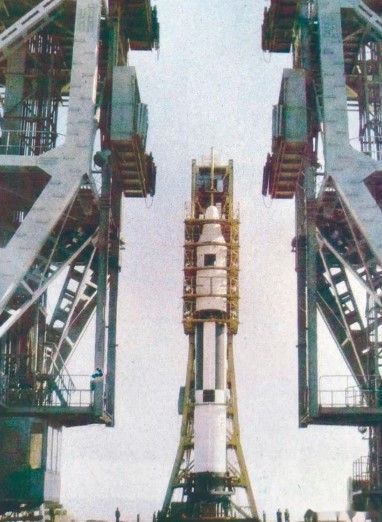

# 1995年
> **本年大事简记**
> 
> - 1月12日，全面启动风云二号第二颗星研制工作
> - 1月26日，长征二号捆绑式运载火箭发射卫星出现故障
> - 2月7日上海航天局更名为上海航天技术研究院
> - 3月13日，中美两国政府签署《备忘录》
> - 5月8日成立航天工业总公司军转民科学技术委员会。12月17日-12月18日，航天军转民科学技术委员会召开成立大会
> - 6月16日，航天基金会筹备会议在北京召开
> - 11月27日，国家航天局副局长和加拿大航天局副局长代表两国签署《备忘录》
> - 11月28日长征二号捆绑式运载火箭发射美国卫星圆满完成
> - 11月朱森园当选为中国航天院院士
> - 12月28日长征二号捆绑式运载火箭成功发射艾科斯达一号通信卫星

## 1月

**一月十日**：**航天工业总公司**[^1]决定==组织质量管理改进研究==，于七月四日发布  **《航天质量管理改革方案》**

**一月十二日**：航天工业总公司通知全面启动**风云二号第二颗星**[^2]的研制工作，并决定将研制工作的==行政领导，技术责任和总体责任==从**第五研究院**转到**上海航天局**
1

**一月二十六日**：**长征二号捆绑式运载火箭**发射**美国修斯公司**研制的**HS601型**亚太二号通信卫星。火箭点火后正常飞离发射场，但在星箭飞行50秒时突然发生故障全部坠毁。嗣后，**中央军委刘华清**，**国务委员宋健**先后对亚太二号发射失利作出重要指示，希望航天科技工作者在成功和曲折中汲取新的经验。
&#x2139;&#xfe0f;**视频资源**
https://www.bilibili.com/video/av9260401/?vd_source=49049ef7468f52fc3c2dd3fe6728824c
## 2月
**二月七日**：中央机构编制委员会办公室同意**上海航天局**更名为**上海航天技术研究院**[^3]
**二月二十三至二十四日**：航空工业总公司党组召开扩大会议，刘纪原总经理从**成绩不小，问题突出，压力巨大，形势严峻，前途光明**5个角度对形势做了深入具体的分析，要求航天工业总公司机关和领导干部撤出"热线"，各负其责，深入研究。==这次会议使航天馆工业总公司党组在一些重大问题上统一了思想，为下一步深化改革理清了思路。==
## 3月
**三月十三日**：中美两国政府在北京签署 **《关于商业发射服务的国际贸易问题协议备忘录》**
**三月二十二日**：航天工业总公司召开**1995航天质量年报告会**[^4]，航天质量年活动拉开序幕
## 4月
**四月十日至十四日**：航天工业总公司召开院，局，基地领导干部会议刘纪原总经理对全面贯彻落实 **《中国航天工业总公司改革与发展纲要》** 进行了动员和部署。会后，航天工业总公司颁布 **《中国航天工业总公司改革与发展纲要》**
## 5月
**五月八日**：航天工业总公司发文，决定成立航天工业总公司军转民科学技术委员会。12月17日-12月18日，**航天军转民科学技术委员会**[^5]召开成立大会。杨家墀任主席
**五月十九日**：**中国长城工业总公司**和**香港亚太通信卫星有限公司**在北京签署了==使用长征三号运载火箭发射亚太一号A卫星的发射服务合同。== 计划于**1996年一季度**用长征三号运载火箭在西昌卫星发射中心发射美国休斯公司研制的**HS-376型通信卫星**。

**五月其他大事**：航天工业总公司**刘兴洲、孙敬良、张贵田、黄文虎、张履谦、陈敬熊、陈德仁**等七位专家当选为**中国工程院院士。**

## 6月--7月
**六月八日**：**国务院总理李鹏**到航天工业总公司调查研究。李鹏总理在调查了解航天工业当前和今后一个时期的科研生产情况后，勉励航天工业总公司==发挥广大科技人员的聪明才智，不断取得新成果。==
**六月十六日**：6月16日，**中国航天基金会筹备会议**在北京召开。1996年 10月16日，==中国航天基金会成立==。在人民大会堂举行的隆重颁奖仪式上，**170名航天功臣、4个航天战线**先进集体获得首届中国航天基金奖。
1
**六月十八日**：**中共中央总书记、国家主席、中央军委主席江泽民**视察沈阳一一一厂，参观了产品陈列室。江泽民总书记题写了﹣-﹣厂精神 =="一体同心、一丝不苟、一往无前。"==
**六月十九至二十九日**：航天工业总公司在**中国革命军事博物馆**举办了"八五"航天预先研究成果展示会，==中央军委领导和军兵种首长对展示的成果给予了高度评价。==
**六月二十日至七月四日**：**国家航天局局长刘纪原**率中国航天代表团访问德国，刘纪原与**德国航天局局长梅尼肯**正式签署了经两国政府批准的两国航天局 **《关于和平利用与研究宇宙空间合作的协议》。**

**七月二十一日至二十六日**：中国人民解放军在东海成功地进行了地对地导弹发射训练，导弹全部准确命中目标。
1
## 8月--9月
**八月十六日至十八日**：航天工业总公司在**广东惠州**召开 **发展外向型经济工作会议。** 会上通过了 **《中国航天工业总公司关于加速发展外向型经济工作的决定》。**
**八月其他大事**：航天工业总公司下发了 **《质量问题归零管理办法》**，提出了**质量问题归零**五个方面的工作和要求。[^6]
**九月二十九日**：航天工业总公司向国务院、中央军委上报了**某重点武器系统关键技术攻关工作的情况**，建议中央尽快批准该导弹武器系统立项研制。**江泽民总书记、李鹏总理、刘华清副主席**对该导弹武器系统有关问题均作出批示。
## 11月
**十一月十日**：航天工业总公司召开了该导弹武器系统(即九月二十九日某重点武器系统)研制工作动员大会。
**十一月二十七日**：**国家航天局副局长王礼恒**与**加拿大航天局副局长德佛塞**分别代表两国航天局==在北京签署《关于空间科学技术领域的合作谅解备忘录》。==
**十一月二十八日**：**长征二号捆绑式运载火箭**在**西昌卫星发射中心**发射**美国马丁公司**研制的**MM-7000型亚洲二号通信卫星**，卫星准确入轨，发射服务圆满完成。由**第四研究院内蒙古**指挥部研制生产的 **EPKM固体发动机**首次飞行成功，==为我国运载火箭与上面级共同开展的商业发射服务开辟了新途径。==
1
**十一月其他大事**：航天工业总公司**朱森元**当选为中国科学院院士。
## 十二月
**十二月四日**：国家航天局局长**刘纪原**与乌克兰国家航天局局长**涅果塔**分别代表两国政府==在北京签署《关于和平利用与研究宇宙空间合作协定》。国家主席江泽民与乌克兰总统库奇马出席签字仪式。==
**十二月十三日**：国家航天局局长**刘纪原**与巴西科技部部长**若泽·依斯拉埃尔·瓦加斯** ==在北京签署《关于加强和扩展中巴空间技术合作的备忘录》。国家主席江泽民与巴西总统费尔南多·恩里克·卡多佐出席签字仪式。==
**十二月十八日**：航天工业总公司向国家计委上报《关于实施国家航天效益工程的请示》。[^7]
**十二月二十八日**：12月28日，**长征二号捆绑式运载火箭**在**西昌卫星发射中心**成功发射了美国制造的**艾科斯达一号通信卫星。**

[^1]:航天工业总公司（英文：China Aerospace Coporation,CAC）,1993年在中国航天工业部基础上组建的国有大型企业公司，于1999年拆分为两家大型集团公司：中国航天科技集团公司（CASC）和中国航天科工集团公司

[^2]:风云二号气象卫星(FY-2)是我国自行研制的第一代地球同步轨道气象卫星，与极轨气象卫星相辅相成，构成我国气象卫星应用体系。风云二号卫星由两颗试验卫星（FY-2A卫星、FY-2B卫星）和四颗业务卫星（FY-2C卫星、FY-2D卫星、FY-2E卫星、FY-2F卫星）组成，作用是获取白天可见光云图、昼夜红外云图和水气分布图，进行天气图传真广播，收集气象、水文和海洋等数据收集平台的气象监测数据，供国内外气象资料利用站接收利用，监测太阳活动和卫星所处轨道的空间环境，为卫星工程和空间环境科学研究提供监测数据。

[^3]:上海航天技术研究院，又名中国航天科技集团公司第八研究院（简称“八院”），创建于1961年8月，是中国航天科技集团公司三大总体院之一，是中国导弹武器系统、运载火箭和卫星生产的主要力量，载人航天工程和探月工程的主要配套单位。办公地址位于上海市闵行区元江路3888号。

[^4]:1995航天质量年汇报会，是中国航天工业在1995年针对质量管理召开的一次重要会议，背景源于当时航天任务连续出现质量问题（如1995年1月长征二号E火箭发射亚太二号卫星时的爆炸事故）
[^5]:航天军转民科学技术委员会，是航天工业总公司有关民用研究开发方面的决策机构，参谋机构。
[^6]:质量问题归零，1996年，航天工业总公司把质量问题归零的五方面要求提炼为：定位要准确，机理要清楚，问题的性质和责任要清楚，措施要可行、有效，举一反三。1996年10月，在航天工业总公司召开的卫星发射动员会上，进一步把质量问题归零精炼为五条标准：定位准确、机理清楚、问题复现、措施有效、举一反三。
[^7]:上报请示后续，1996年3月4日，刘纪原率航天工业总公司机关有关部门领导向国务院副秘书长刘济民汇报了航天效益工程的有关问题。3月6日，在八届人大四次会议上，陕西代表团32名人大代表联名签署题为《建议国家决策和立项开发航天效益工程﹣﹣航天育种和卫星减灾系统》的议案提交八届人大四次会议提案组，建议国家决策和立项开发包括航天育种工程和卫星减灾系统在内的航天效益工程，将该工程纳入我国国民经济和社会发展"九五"计划，让我国航天高技术充分发挥作用，服务于国民经济建设各领域。