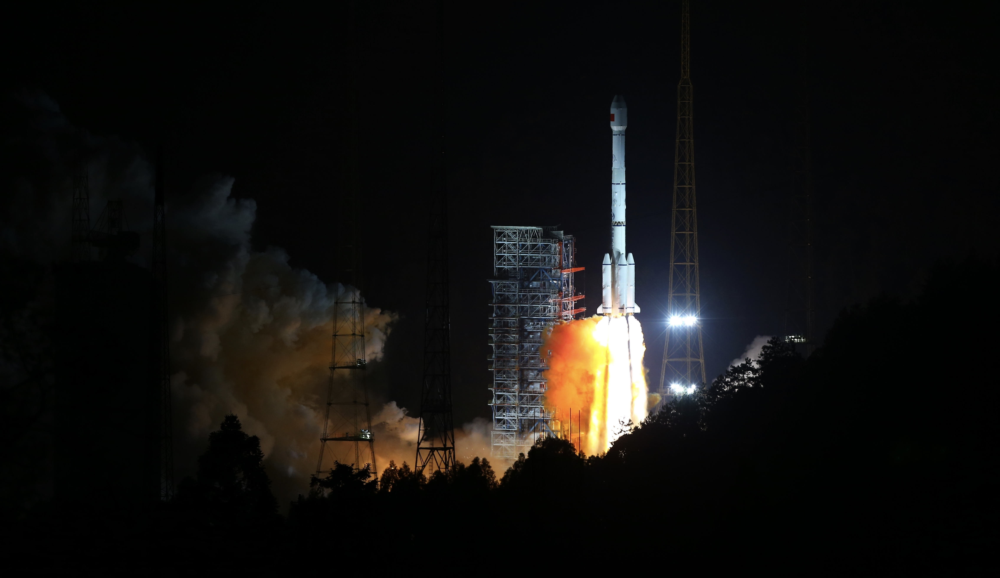

<!--
 * @Author: blueWALL-E
 * @Date: 2025-06-25 14:27:14
 * @LastEditTime: 2025-06-25 14:43:11
 * @FilePath: \Chinese Aerospace History\中国航天编年史\大事年表\中国航天大事记-模板.md
 * @Description: 中国航天大事记
 * @Wearing:  Read only, do not modify place!!! 
 * @Shortcut keys:  ctrl+alt+/ ctrl+alt+z
-->

# 2016年

## 1月

**1月16日**：长征三号乙火箭(西昌)成功将白俄罗斯通信卫星送入轨道，这是中国整星交付服务首次进入欧洲市场。

## 2月

**2月1日**：长征三号丙火箭(西昌)成功发射北斗卫星导航系统第5颗新一代卫星。

## 3月
**3月30日**：长征三号丙火箭(西昌)发射北斗卫星导航系统第22颗卫星。

## 4月

**4月6日**：长征二号丁火箭(酒泉)成功发射实践十号返回式微重力卫星，开展空间生命科学试验。

## 5月

**5月15日**：长征二号丁火箭(酒泉)发射遥感卫星三十号，开展国土资源普查等任务。

**5月30日**：长征四号乙火箭(太原)发射资源三号02星，用于环境监测。

## 6月
**6月12日**：长征三号丙火箭(西昌)发射北斗卫星导航系统第23颗卫星，为北斗区域系统提供服务。

**6月25日**：长征七号火箭在海南文昌航天发射场进行首飞，这标志着中国新一代中型火箭研制成功，并为空间站货运飞船发射任务开辟新途径。

## 8月

**8月6日**：长征三号乙火箭(西昌)发射我国首颗移动通信卫星"天通一号01星"。

**8月10日**：长征四号丙火箭(太原)发射高分三号卫星，我国首颗1米分辨率多极化SAR卫星，显著增强全天候地球观测能力。

**8月16日**：长征二号丁火箭(酒泉)发射"墨子号"量子科学实验卫星和携带大气探测等卫星。

## 9月
**9月**：长征二号F/Yao-2(神舟十一用)和长征四号丙(风云三号D星用)均完成多次可靠发射，进一步提升了火箭可靠性和密集发射能力。

**9月15日**：长征二号FT2运载火箭在酒泉卫星发射中心点火，将天宫二号空间实验室送入预定轨道，发射取得圆满成功。

## 10月

**10月17日**：长征二号F(遥十一运载火箭)在酒泉发射场发射神舟十一号载人飞船，航天员景海鹏、陈冬进入太空；他们在天宫二号飞行33天(中国航天驻留时间之最)后，于2016年11月18日安全返回地面，标志任务圆满完成。

## 11月

**11月3日**：长征五号火箭首次飞行成功（目前中国运载能力最大的火箭）。

**11月18日**：神舟十一号飞船安全返回地面，标志任务圆满完成。

## 12月
**12月27日**：中国政府发布《2016中国的航天》白皮书，明确提出"自2016起，每年4月24日为中国航天日"；同年白皮书规划未来五年航天重大任务，为深空探测等提供政策指引。

# 2017年

## 1月

**1月5日**：长征三号乙火箭(西昌)发射通信技术试验卫星二号(模拟高通量通信卫星)，实现2017年发射"开门红"。

**1月30日**：新华社报道国家航天局副局长吴艳华透露，中国深空探测未来将实施4次重大任务:2020年前后发射首个火星探测器(实现环绕与着陆巡视)，随后实施火星采样返回任务，以及开展小行星和木星系探测。这一规划与2016年《中国的航天》白皮书提出的"深空探测"任务一脉相承。

## 4月

**4月12日**：长征三号乙火箭(西昌)发射实践十三号卫星(我国首颗高通量通信卫星，通信容量20Gbps)，提升通信能力。

**4月20日**：中国首艘货运飞船天舟一号搭乘长征七号火箭(文昌发射场)成功发射，奔赴天宫二号空间实验室。

**4月22日**：天舟一号自动与天宫二号对接，实现首艘货运飞船补给对接。

## 6月

**6月15日**：长征四号乙火箭(酒泉)发射中国首颗X射线天文卫星"慧眼"(Insight-HXMT)，同时搭载乌拉圭NewSat-3卫星和中国"珠海一号"微纳星座卫星。

## 7月
**7月2日**：长征五号实施第二发(遥二号)飞行，由于发动机故障发射失败(346秒出现异常)。故障调查于2018年完成，计划2018年底发射"长五遥三"并完成嫦娥五号月球采样返回任务。

## 8月

**8月21日**：中国航天员与2名欧洲航天员在山东烟台海域完成首次海上救生训练，这是中国首次邀请欧洲航天员参与载人航天训练。

## 9月

**9月29日**：长征二号丙火箭(西昌)"一箭三星"发射遥感三十号01组卫星，进一步丰富对地观测手段。

## 10月

**10月9日**：长征二号丁火箭(酒泉)成功发射委内瑞拉第二颗遥感卫星VRSS-2，为国际合作项目。

## 11月

**11月5日**：长征三号乙/远征一号组合运载火箭(西昌)成功发射北斗三号首发双星，标志中国新一代全球导航系统建设迈出关键步伐。

**11月15日**：长征四号丙火箭(太原)成功发射风云三号D星，第二代极地轨道气象卫星，将提升全球气象探测和灾害预警能力。

**11月21日**：长征六号火箭(太原)首次执行商业发射，"一箭三星"发射三颗吉林一号卫星，彰显中国运载火箭商业化能力。
